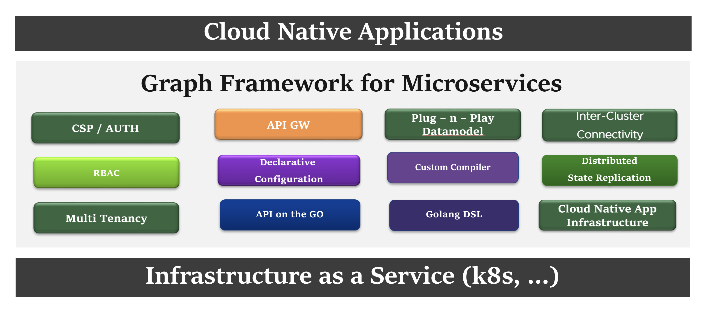
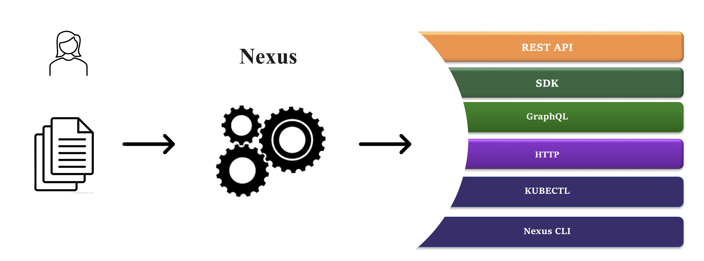

# Nexus; The Graph Framework for Microservices

Graph Framework for Microservices is a platform software stack that bootstraps and accelerates cloud-native microservice development, that is out-of-the-box ready to thrive in the ever challenging world of distributed systems and SaaS.

It provides an extensible, distributed software stack that:

* accelerates cloud native application development
* simplifies consumption
* provides a out-of-the-box platform that is distributed, consistent, stable and feature rich
* provides a plug-and-play runtime for core platform functions

This framework represents the application's datamodel/state as a Graph, with emphasis on the event-driven propagation of data.

https://user-images.githubusercontent.com/49454273/236585215-d2e92955-d3d3-47d5-b701-61dc97a90078.mov

### [Playground](docs/getting_started/Playground.md)

## What problem does it solve ?

A plethora of tools and utilities have cropped up to address the challenge of writing and operating applications in distributed, cloud-native, SaaS environments.
This is particularly true in the realm of [Kubernetes](https://collabnix.github.io/kubetools/).

Cloud native applications of today, need contracts, not tools. Contracts that will implement and provide guarantees around distributed system functions, state management, replication etc. Instead, applications are forced to solve the complex problems around distributed systems and platform first, before they can actually get to implementing their very cool business use case and value add. This is simply put - just nuts !

Applications are desperate for a unified framework that provides:

* API declaration, API endpoint management, versioning, packaging, rollout and more
* a hierarchical datamodel that is declarative, consistent, custom built and configurable
* API first design, with support for APIs beyond CRD: graphql, custom REST API/URL etc
* an integrated RBAC that can be versioned, codified
* a distributed runtime, with API Gateway, that will seamlessly stretch across product boundaries and cluster boundaries
* toolchain to aid, fast-track application development
* a programmatic library to provide a cloud native development paradigm
* a single tool to hold all of the above together

In essence, taking K8s as a example, what applications want is not K8s, not be limited by K8s, but rather to build on top of K8s.

Graph Framework for Microservices addresses these challenges head-on through its integral software stack: Nexus

## Nexus

Nexus is the "core" software stack of the Graph Framework for Microservices.

Nexus provides:

* [Simple & intuitive DSL](compiler/DSL.md) to specify datamodel.
* [Compiler](compiler/README.md) that understands Nexus DSL and generates datamodel spec and libraries.

Given an application's intent as a declarative spec, Nexus provides the ability to consume the application's data / state through a plethora of commonly used interfaces and API.
