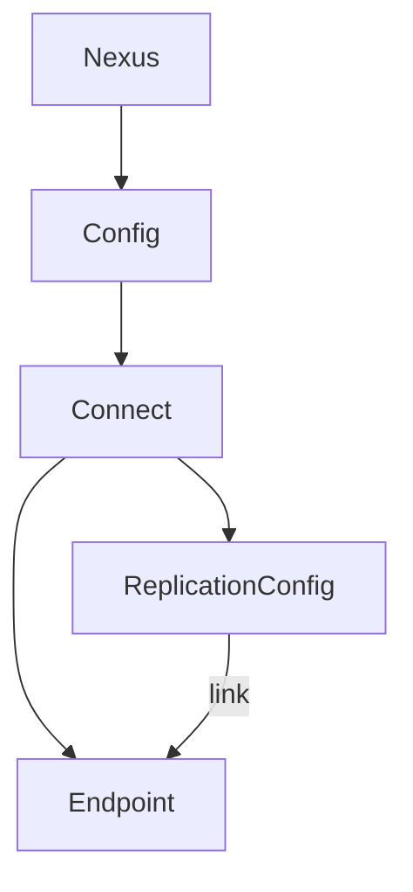

# Connector

Nexus-Connector supports on-demand replication of the state between two endpoints. It supports replication between hierarchical source and non-hierarchical destination, and vice versa. 

## Connect Datamodel

Nexus Connector functions with the help of Nexus Connect datamodel. Connect DM has two APIs:
1.	**NexusEndpoint CRD** that provides that ability to specify the remote endpoint configuration that is to be served by the connector instance.
2.	**ReplicationConfig CRD** that provides the ability to specify the resource type that needs to be replicated to the desired remote endpoint. ReplicationConfig API has the following attributes: 
    - Ability to specify the source either as a resource-type or a specific object.
    - Ability to sync either into a hierarchy or non-hierarchy datamodel .
    - Ability to sync into a specific namespace in the destination datamodel. 
    - Ability to sync source objects based on namespace, labels or both. 
    - Ability to sync objects of one type to another. 
    - Ability to sync default resource-types like Deployment, Pod, Service, Namespace etc. to CRD in the hierarchy. 
    - Ability to sync CRD objects of one version to another. 

## How Nexus-Connector Works: 

1. Nexus-Connector watches for objects on the source endpoint and syncs them to the desired destination endpoint based on ReplicationConfig and Nexus Endpoint configuration.
2. It watches the ReplicationConfig object, learns the remote endpoint information and does one-time sync of resource type from source to destination. (This happens in handlers/replicationconfig_handler.go file)
3. It runs watchers to dynamically watch the create/update/delete events of the objects that are of interest for replication, and maintains the state between two endpoints. (handlers/handlers.go and handlers/replicator.go file)
4. It maintains a map of resource types/objects pointing to replication-config entries based on which the dynamic watcher decides whether or not the object is of interest for replication. (utils/construct.go)
5. It runs a CRD reconciler to learn all the source CRD types and cache the parent and children information. (controllers package)
6. It also supports replication of custom status back to source based on "StatusReplicationEnabled" flag.

## Some examples

The below diagram illustrates examples of how connector works to sync into a hierarchical/non-hierarchical destination.

### From Hierarchical Source to Non-Hierarchical Destination.

1. Replicates the source object and its immediate children and NOT the entire sub-graph.
2. Replicates only the spec and ignores the relationship.
3. Copies the labels and annotations as is from source CR to destination CR.
4. Patches status of replication on the source CR for every update on CR.
5. Annotates the source type information to the destination object.

In the below-example, if user has enabled replication for the object "Cluster Bar", then connector syncs ClusterBar and its immediate children GNSBinding Bar and Policy A. 

### From Non-Hierarchical Source to Hierarchical Destination.

1. Populates the labels in the destination object that are configured in the replication config.
2. Copies the labels and annotations as is from source CR to destination CR.
3. Patches replication status on the source CR for every update on CR.
4. Annotates the source type information to the destination object.

In the below example, if user has enabled replication for the type "K8s Services", then connector syncs all the objects of that type.

## Development
### Guidelines

Any and every code change MUST follow code style guidelines and pass following checks:

- Unit Test cases are mandatory for any and every code change.
- `make test-fmt` - makes sure code formatting matches standard golang formatting.
- `make lint` and `make vet` - static code analysis looking for possible programming errors, bugs, stylistic errors, and suspicious constructs.
- `make race-unit-test` - executes unit tests with race flag to look for possible race conditions.

## Build
### Build in containerized sandbox

To run build in a fixed/sandboxed environment:
1. Download the build sandbox: `make docker.builder`
2. Build nexus connector: `make docker`

## Test
### Run tests in containerized sandbox

To run tests in a fixed/sandboxed environment:
1. Download the test sandbox: `make docker.builder`
2. Test nexus compiler: `make test_in_container`
