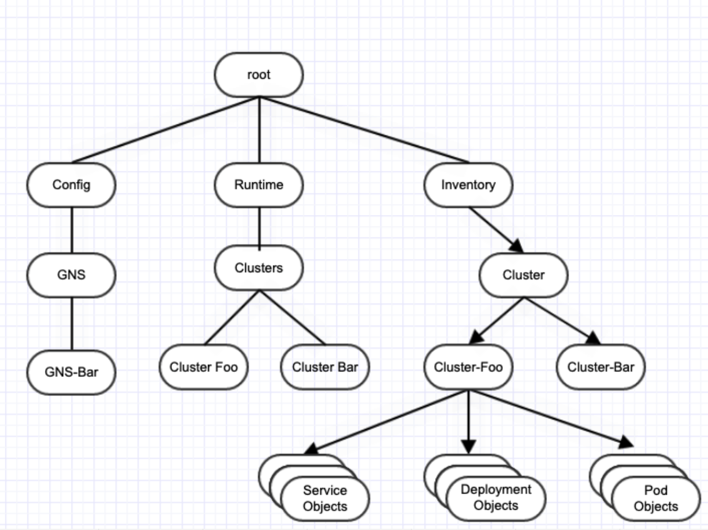
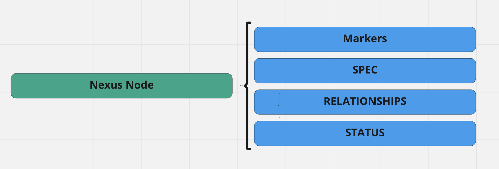
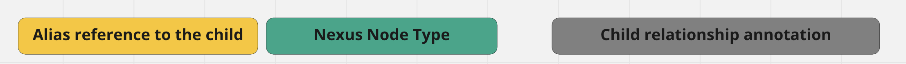
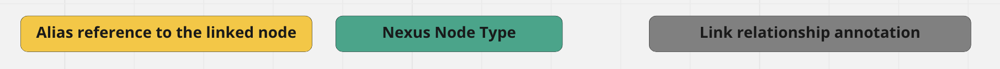

# Nexus DSL

Nexus DSL empowers applications to specify its datamodel in Go (also called Golang or Go language).

Using Go, applications can express its datamodel as a graph, the specification of a node in the graph, its hierarchy, its relationships etc.

Why Go? Go is easy to read, easy to type and easy to parse. Golang's structs are
natural data types definitions and Golang's annotations and comments can be used as additional parameters.

## Datamodel as a Graph

A datamodel allows an application to structure its business data for simplified organization, storage and consumption. Cloud native applications are rarely static. These applications evolve constantly and often. As these applications evolve, so does its datamodel as well. Relational datamodels are not well suited to handle this agility.
Graph datamodels fit that bill.

Graph datamodels are agile, flexible and highly performant while allow the datamodel and inturn data to grow along with the application and business needs.

Graph datamodel is composed of two types of elements: nodes and relationships
- nodes representing an entity (a person, place, thing etc)
- relationships representing how any two nodes are associated

Nexus DSL represent your application data as a Graph Datamodel.

# Nexus Graph

A graph in Nexus datamodel is a collection of Nexus nodes and their relationships.



Graph built using Nexus DSL will have the following attributes:

* Graph will be directed and acyclic.
* Graph is rooted by a Nexus node. A root node in the graph is a node which is not claimed as child by any other nexus node.
* Nexus compiler only allows one root node per datamodel. There can be no disjoined node. Each Nexus node, expect for root node, should have a parent.

## Graph Syntax

### TL;DR [here](#Nexus-DSL-syntax-shortcut)

# Nodes: Go Structs

Nexus node is a Go struct/type annotated as a graph node.

As it is a Go struct, it can hold fields of all valid Go types.

In a datamodel, _not all Go structs are Nexus nodes, but all Nexus nodes are Go structs._

A Go struct can be declared as a node in the graph by including `nexus.Node` (defined [here](https://github.com/vmware-tanzu/graph-framework-for-microservices/blob/main/nexus/nexus/nexus.go)) as an embedded field in the struct.

<details><summary>Example</summary>

```Go
package role

import (
	"github.com/vmware-tanzu/graph-framework-for-microservices/nexus/nexus"
)

// FullName is NOT a graph node.
// It is just a Go type.
type FullName struct {
  FirstName string
  LastName  string
}

// Leader is a graph node and a Go type.
type Leader struct {
	nexus.Node
	EmployeeID int
	Name       FullName
}
```
</details>

### Structure



### Attributes of a Nexus Node

* A Nexus node is a _Type_. At runtime, the graph can have one or more objects for a Nexus node.
* Name of the Nexus node is scoped (and as such should be unique) within a Go package.
* A Nexus node can referenced in another Nexus node only in the context of Relationships. So the implied corollary is that nexus nodes types cannot be referenced as type in any non-relationship fields.

## Singleton Nexus Node

Singleton Nodes are special Nexus nodes that can have only one object instance in the graph.

While there is no limit on the number of objects of a nexus node at runtime, a singleton nexus node can only have a single object instance in the graph at any time.

A Go struct can be declared as a singleton Nexus node in the graph by including `nexus.SingletonNode` (defined [here](https://github.com/vmware-tanzu/graph-framework-for-microservices/blob/main/nexus/nexus/nexus.go)) as an embedded field in the nexus node Go struct.

<details><summary>Example</summary>

```Go
package role

import (
	"github.com/vmware-tanzu/graph-framework-for-microservices/nexus/nexus"
)

type SingleLeader struct {
	nexus.SingletonNode

	EmployeeID int
}
```

</details>

### Usecase

In cases where there is no need for more than one instance of a node, the name of the node becomes irrelevant. In those cases, singleton node provide a convenient way to interace with datamodel as application code and API does not need to reference the node by name. The runtime is capable of identifying that a node is singleton and assume the name to be "default".

### Attributes of a Singleton Nexus Node
* A singleton Nexus node is a _Type_. At runtime, the graph can have one object with name "default"
* A singleton Nexus node has a special meaning at runtime, in that, the runtime will assume the name "default" for singleton nodes.

# Relationships

Nexus nodes can be associated with other Nexus nodes only through _Relationships_.

Nexus DSL supports two types of relations between Nexus nodes:

- child / children
- link / links

## Child / Children

A _Child_ or _Parent-Child_ relationship provides a way to designate one Nexus node as a "parent" or as a hierarchical root to other Nexus node/s in the graph.

A node that claims child relationship to another node is referred to as _Parent._

A node that is claimed as a child is referred to as a _Child._

A child relationship can be claimed by declaring a field with following syntax:



**Alias reference to the child**: a name by which this parent will reference this child

**Nexus Node Type**: the node to be claimed as child

**Child relationship annotation**:

Child relationship annotation can be expressed in one of the following formats:

* `nexus:"child"` if the parent can only claim a specific object of a Nexus Node, as a child
* `nexus:"children` if the parent can claim multiple child objects of a Nexus node, as children

<details><summary>Example</summary>

```Go
package role

import (
	"github.com/vmware-tanzu/graph-framework-for-microservices/nexus/nexus"
)

// FullName is NOT a graph node.
// It is just a Go type.
type FullName struct {
  FirstName string
  LastName  string
}

// Leader is a graph node and a Go type.
type Leader struct {
	nexus.Node
	
	EmployeeID int
	Name       FullName

    Office     OfficeSpace `nexus:"child"`
    Employees  Employee    `nexus:"children"`
}

// Employee is a graph node and a Go type.
type Employee struct {
  nexus.Node

  EmployeeID int
  Name       FullName
}

// OfficeSpace is a graph node and a Go type.
type OfficeSpace struct {
  nexus.Node
  
  Id int
}
```
</details>

### Attributes of a Child Relationship

* A Nexus node cannot be claimed by more than one Nexus node as a child. In other words, each Nexus node can have at most one parent.
* Object for child Nexus node can only be created if the object of its parent Nexus node exists in the graph.
* Lifecycle of the child objects are tied to the lifecycle of the parent object. If the parent object is deleted, all children are deleted as well.
* Lifecycle of the parent object is independent of the lifecycle of the children object. Parent can exist even if the child object does not exist.
* Circular relationships are prohibited; i.e a parent node cannot be claimed as a child by any of the Nexus nodes in the parent's hierarchy


## Link / Links

A Link relationship provides a way to designate one Nexus node as related or relevant to another Nexus node/s in the graph. Link relationships provide a soft or non-hierarchical construct to associate nodes in the graph.

A node that claims the link relationship to another node is referred to as _Source_.

A node that is claimed as a linked node is referred to as a _Destination_.

A link relationship can be claimed by declaring a field with following syntax:



**Alias reference to the linked node**: a name by which this parent will reference this linked node

**Nexus Node Type**: the node to be claimed as linked node

**Link relationship annotation**:

Link relationship annotation can be expressed in one of the following formats:
* `nexus:"link"` if the Source node should link to a specific object of a Destination Nexus node
* `nexus:"links` if the Source node should like to multiple objects of a Destination Nexus node

<details><summary>Example</summary>

```Go
package role

import (
	"github.com/vmware-tanzu/graph-framework-for-microservices/nexus/nexus"
)

// FullName is NOT a graph node.
// It is just a Go type.
type FullName struct {
    FirstName string
    LastName  string
}

type Organization struct {
	nexus.Node
	
	CEO             Leader  `nexus:"child"`
	GLobalLocations Address `nexus:"children"`
}
// Leader is a graph node and a Go type.
type Leader struct {
	nexus.Node
	
	EmployeeID     int
	Name           FullName

    Office         OfficeSpace `nexus:"child"`
    Employees      Employee    `nexus:"children"`
	
	BaseLocation   Address `nexus:"link"`
	TeamLocations  Address `nexus:"links"`
}

// Employee is a graph node and a Go type.
type Employee struct {
    nexus.Node

    EmployeeID     int
    Name           FullName

    BaseLocation   Address `nexus:"link"`
}

// OfficeSpace is a graph node and a Go type.
type OfficeSpace struct {
    nexus.Node
  
    Id int
}

type Address struct {
    nexus.Node
	
    Country    string
    PostalCode string
    Street     string
}
```
</details>

### Attributes of a Link Relationship

* A Nexus node can be linked by any other Nexus node in the graph, without restrictions.
* A link can only be created to objects that exist in the graph.
* Lifecycle of the link is tied to the lifecycle of the Source node. If the Source node is deleted, the link is deleted.


# Spec

Nexus node spec is list of all fields that constitute data associated with the node.

The fields are standard Go types and as such are generic.

However the fields can be annotated with annotations and markers so as to influence and enhance its treatment at both compilation and runtime.

## Annotations

### Encoding Tags

Tags provide transformation info on how a struct field is encoded to or decoded from another format.

Spec fields support two types of tagging:

| Tag  | Format    | Description                          |
|------|-----------|--------------------------------------|
| json | `json:"startTime,omitempty"`     | interpreted by encoding/json package |
| mapstructure  | `mapstructure:"startTime,omitempty"`      | interpreted by mitchellh/mapstructure package |

**_NOTE:_**
* We recommend both json and mapstructure tags for compiler and tooling will encode the field as explicitly stated
* The keyword "omitempty" can be skipped if the field is a mandatory field in the spec

<details><summary>Example</summary>

```Go
type GNS struct {
    nexus.Node
    Domain                      string          `json:"domain,omitempty" mapstructure:"domain,omitempty"`
    UseSharedGateway            bool            `json:"useSharedGateway,omitempty" mapstructure:"useSharedGateway,omitempty"`
    MTLSEnforced                bool            `json:"mTLSEnforced,omitempty" mapstructure:"mTLSEnforced,omitempty"`
    MTLSPermissive              bool            `json:"mTLSPermissive,omitempty" mapstructure:"mTLSPermissive,omitempty"`
    ApiDiscoveryEnabled         bool            `json:"apiDiscoveryEnabled,omitempty" mapstructure:"apiDiscoveryEnabled,omitempty"`
    MTLSExceptions              MtlsExceptions  `json:"mTLSExceptions,omitempty" mapstructure:"mTLSExceptions,omitempty"`
    CaType                      string          `json:"caType,omitempty" mapstructure:"caType,omitempty"`
    Ca                          string          `json:"ca,omitempty" mapstructure:"ca,omitempty"`
    Description                 string          `json:"description,omitempty" mapstructure:"description,omitempty"`
    Color                       string          `json:"color,omitempty" mapstructure:"color,omitempty"`
}
```
</details>

### GraphQL Generation Tags

Nexus compiler generates GraphQL schema for Nexus nodes.

GraphQl schema is syntax and option rich.

Spec fields support a collection of GraphQL specific annotations that provide directives to the Nexus compiler so it can generate GraphQL schema appropriately.

| Tag  | Format                                | Description                                                                                                                                                                                                                                                                       |
|------|---------------------------------------|-----------------------------------------------------------------------------------------------------------------------------------------------------------------------------------------------------------------------------------------------------------------------------------|
| nexus-alias-name | `nexus-alias-name:"value"`            | Name to override the default name of the field in GraphQL spec.                                                                                                                                                                                                                   |
| nexus-alias-type  | `nexus-alias-type:"value"`            | Type name to override the Type of the field in GraphQL spec.                                                                                                                                                                                                                      |
| nexus-graphql-args | `nexus-graphql-args:"key: value"`     | Filter parameters. Filter parameters are only supported for fields with object types that are lists, and if no annotation is provided, the default value is set to (id: ID)                                                                                                       |
| nexus-graphql-ts-type | `nexus-graphql-ts-type:"value"` | Location of the typescript spec where the type definition for this field is declared                                                                                                                                                                                              |
| nexus-graphql-type-name | `nexus-graphql-type-name:"value"` | Used to create new Go alias type for external types.                                                                                                                                                                                                                              |
| nexus-graphql-nullable  | `nexus-graphql-nullable:"false"` | Specified if the field is nullable. In GraphQL, a non-nullable field is one that must always have a value and it is represented using an exclamation mark (`!`) after the field type. Compiler will use this annotation to mark the field appropriately as nullable or otherwise. |
| nexus-graphql-jsonencoded | `nexus-graphql-jsonencoded:""` | Adds empty jsonencoded annotation to generated GraphQL schema.                                                                                                                                                                                                                    |
| nexus-graphql-relation-name | `nexus-graphql-relation-name:"value"` | Adds a @relation directive with a name parameter to generated GraphQL schema.                                                                                                                                                                                                     |
| nexus-graphql-relation-parameters | `nexus-graphql-relation-parameters:"value"` | Adds `parameter` parameter to existing @relation directive or to create a new one in generated GraphQL schema.                                                                                                                                                                    |
| nexus-graphql-relation-uuidkey  |  `nexus-graphql-uuidkey:"value"` | Adds `uuidkey` parameter to existing @relation directive or to create a new one in generated GraphQL schema                                                                                                                                                                       |
| nexus-graphql-protobuf-name | `nexus-graphql-protobuf-name:"value"` | Adds @protobuf directive with a `name` parameter to generated graphql schema.                                                                                                                                                                                                     |
| nexus-graphql-protobuf-file | `nexus-graphql-protobuf-file:"value"` | Adds `file` parameter to existing @protobuf directive or to create a new one in generated graphql schema.                                                                                                                                                                         |

<details><summary>Example</summary>

```Go
type GNS struct {
    nexus.Node

    GeoDiscovery  gns_geo_disc.GeoDiscovery `nexus:"children" nexus-alias-name:"GeoDiscovery"`

    SvcMetric    string `nexus-alias-type:"ServiceMetricTypeEnum"`

    ServiceVersions global_service_version.ServiceVersion `nexus:"children" nexus-graphql-args:"name: String"`

    Name string `nexus-graphql-nullable:"false"`

    Value   AttributeValue `nexus-graphql-ts-type:"./common/ts/common.d.ts"`

    Data string `nexus-graphql-jsonencoded:""`

    Clusters ClusterSettings `nexus:"children" nexus-graphql-relation-name:"HAS"`

    Domains DomainSettings `nexus:"children" nexus-graphql-relation-name:"HAS" nexus-graphql-relation-parameters:"DomainSettingsStatus"`

    Services Service      `nexus:"links" nexus-graphql-relation-uuidkey:"true"`

    Capability string `nexus-graphql-protobuf-name:"RegisterCapabilityArguments"`

    Capability string `nexus-graphql-protobuf-name:"RegisterCapabilityArguments" nexus-graphql-protobuf-file:"./common-apis/protos/external-plugin/ep-server.proto"`

}
```

**Generated GraphQL Schema**

```graphql
type GNS {
    
    GeoDiscovery(id: ID): [GeoDiscovery!]
      
    svcMetric: ServiceMetricTypeEnum

    serviceVersions(name: String): [ServiceVersion!]

    name: String!

    value: String @jsonencoded(gofile:"model.go", name:"AttributeValue", file:"./common/ts/common.d.ts")

    data: String @jsonencoded

    clusters(name: ID): [ClusterSettings!] @relation(name:"HAS")

    domains(name: ID): [DomainSettings!] @relation(name:"HAS", parameters:DomainSettingsStatus)

    services(name: String): [Service!] @relation(softlink: "true", uuidkey:"true")

    capability: String @protobuf(name:"RegisterCapabilityArguments")

    capability: String @protobuf(name:"RegisterCapabilityArguments", file:"./common-apis/protos/external-plugin/ep-server.proto")

}
```
</details>

### Inferences/Assumptions

**1) Arguments**

Every field on a GraphQL object type can have zero or more arguments.

But in Nexus we support filter params for only GraphQL field with list object type (children,links) can have arguments.

### Example:
**CHILDREN**

```go
type AppFolder struct {
    nexus.Node
    App global.App `nexus:"children" nexus-graphql-args:"name: ID"`
}
```

```graphql
type AppFolder {
    id: ID
    app(name: ID): [App!]
}
```

**LINKS**

```go
type AppGroup struct {
    nexus.Node
    Services global.Service `nexus:"links" nexus-graphql-args:"name: String" nexus-graphql-tsm-directive:"@relation(softlink: \"true\", uuidkey: \"true\")"`
}
```

```graphql
type AppGroup {
    name: ID
    services(name: String): [Service!]
        @relation(softlink: "true", uuidkey: "true")
}
```

#### Limitations

**Enums**

Nexus DSL doesn't support enums, so all enums should be defined in file `cosmos-datamodel/common/enums.graphql`

**Link property schema**

Soft links/ Hard links property are Non nexus nodes.

They are defined in file `cosmos-datamodel/common/parameters.graphql`

## OpenAPI validation

Spec fields of nexus nodes can be extended with additional validation.

For field which should be validated you can add the following comment above a field with format 

`//nexus-validation: Validation pattern`.

<details><summary>Example</summary>

```Go
package role

import (
  "github.com/vmware-tanzu/graph-framework-for-microservices/nexus/nexus"
)

type Leader struct {
  nexus.Node
  //nexus-validation: MaxLength=8, MinLength=2
  //nexus-validation: Pattern=abc
  Department string
  EmployeeID int
}
```
</details>

More details here: https://confluence.eng.vmware.com/pages/editpage.action?pageId=1367787440

**TBD: Move to github.**

# Markers

## GraphQL

### GraphQLSpec

Nexus GraphQl spec is to specify a node level attribute: ie. what is the name of the ID field and is the ID field nullable.

```go
type GraphQLSpec struct {
   IdName     string.       <--- default is empty string. In which case we assume "id"
   IdNullable bool          <--- default is true. In which case is will be nullable.
}
```

#### Example-1:
**Default behavior**

Nexus Node will be annotate as `nexus.Node` and it is generated as `id: ID` in GraphQL schema

**Nexus DSL**

```go
type Foo1 struct {
    nexus.Node
}
```

**GraphQL Schema**

```graphql
type Foo1 {
    id: ID
}
```

#### Example-2:
Here is an example of Nexus DSL with support of Nexus GraphQL spec

Nexus GraphQl Spec is used to modify the default behavior

**Nexus DSL**

```go
var Foo1GraphqlSpec = GraphQLSpec{
    IdName: "name",
    IdNullable: false,
}
// nexus-graphql-spec:Foo1GraphqlSpec
type Foo1 struct {
    nexus.Node
}
```

**GraphQL Schema**

```graphql
type Foo1 {
    name: ID!
}
```

## Secrets

To define nexus secret node, add `nexus-secret-spec` annotation on nexus node, and compiler will not generate graphql code for nexus secret node.

DSL can be defined as below to add secret in a nexus node

```
var ApiKeySecretSpec = nexus.SecretSpec{}

// nexus-secret-spec:ApiKeySecretSpec
type Foo struct {
   nexus.Node
   Password  string
}
```

## REST API

Nexus DSL provides the syntax to access a Nexus node through one or more REST API's. 

The syntax for declaration of REST API for a Nexus node has 2 parts in Nexus DSL:

1. Create an instance of type [nexus.RestAPISpec](https://github.com/vmware-tanzu/graph-framework-for-microservices/blob/main/nexus/nexus/nexus.go) that defines one or most REST APIs.

2. Associate the `nexus.RestAPISpec` instance with a Nexus node.

#### nexus.RestAPISpec

Declares one or more REST API's.

Each API spec captures information about the REST API, such as:

* URI
* Allowed http methods
* Desired Response codes

#### Associate nexus.RestAPISpec with Nexus node

The association of an instance/variable of type nexus.RestAPISpec to a Nexus node is achieved by adding a `comment` on the Nexus node in the following format:

`//nexus-rest-api-gen:<variable of type nexus.RestAPISpec>`

The keyword `nexus-rest-api-gen` is an instruction in Nexus DSL to the Nexus Compiler that the referenced REST API's should be associated with the Nexus Node.

<details><summary>Example</summary>

```Go
package role

import (
  "github.com/vmware-tanzu/graph-framework-for-microservices/nexus/nexus"
)

var LeaderRestAPISpec = nexus.RestAPISpec{
  Uris: []nexus.RestURIs{
    {
      Uri: "/v1alpha2/root/{root}/leader/{role.Leader}",
      Methods: nexus.HTTPMethodsResponses{
        http.MethodGet: nexus.DefaultHTTPGETResponses,
      },
    },
    {
      Uri: "/v1alpha2/leader",
      QueryParams: []string{
        "root",
        "role.Leader"
      },
      Methods: nexus.HTTPMethodsResponses{
        http.MethodGet: nexus.DefaultHTTPGETResponses,
      },
    },
    {
      Uri:     "/v1alpha2/root/{root}/leader",
      Methods: nexus.HTTPListResponse,
    },
  },
}

// nexus-rest-api-gen:LeaderRestAPISpec
type Leader struct {
  nexus.Node
  EmployeeID int
}
```
</details>

The above example, defined a variable LeaderRestAPISpec of type nexus.RestAPISpec. This variable is then referenced in the code comment on Nexus node using the keyword: `nexus-rest-api-gen`

## Custom GraphQL Query spec

Custom GraphQl query spec is a way of extending GraphQl server with queries to external GRPC servers. 

To add custom queries you need to use `nexus.GraphQLQuerySpec` struct imported from
[nexus](https://github.com/vmware-tanzu/graph-framework-for-microservices/blob/main/nexus/nexus/nexus.go) package.

This is a collection  of `nexus.GraphQLQuery` structs. A GraphQLQuery specifies a custom query available via GraphQL API.
Each GraphQLQuery is self contained unit of the exposed custom query.
Format is as following:

```Go
type GraphQLQuery struct {
    Name            string               `json:"name,omitempty"`             // query identifier
    ServiceEndpoint GraphQLQueryEndpoint `json:"service_endpoint,omitempty"` // endpoint that serves this query
    Args            interface{}          `json:"args,omitempty"`             // custom graphql filters and arguments
    ApiType         GraphQlApiType       `json:"api_type,omitempty"`         // type of GRPC API endpoint
}
```

Currently there are two API types supported:
- NexusGraphQL Query, [proto file](https://github.com/vmware-tanzu/graph-framework-for-microservices/blob/main/nexus/proto/graphql/query.proto)
  specifies Query requests and responses which server should implement
- GetMetrics, [proto_file](https://github.com/vmware-tanzu/graph-framework-for-microservices/blob/main/nexus/proto/query-manager/server.proto)
  specifies expected requests and responses.

In NexusGraphQL Query you can provide any arguments, they will be translated into a `UserProvidedArgs` map. In GetMetrics arguments can be a
subset of well-known [MetricsArg](https://github.com/vmware-tanzu/graph-framework-for-microservices/blob/main/nexus/generated/query-manager/server.pb.go#L23)
arguments (`Metric`, `StartTime`, `EndTime`, `TimeInterval`) or additional custom arguments which will be translated into a `UserProvidedArgs` map.

GraphQlQuerySpec can be attached to a Nexus Node using comment above a Node.

<details><summary>Example</summary>

```Go
package role

import (
  "github.com/vmware-tanzu/graph-framework-for-microservices/nexus/nexus"
)

// nexus-graphql-query:MyCustomQueries
type Leader struct {
  nexus.Node
  EmployeeID int
}

var MyCustomQueries = nexus.GraphQLQuerySpec{
  Queries: []nexus.GraphQLQuery{
    {
      Name: "queryGns1",
      ServiceEndpoint: nexus.GraphQLQueryEndpoint{
        Domain: "nexus-query-responder",
        Port:   15000,
      },
      Args:    QueryFilters{},
      ApiType: nexus.GraphQLQueryApi,
    },
    {
      Name: "queryMetrics1",
      ServiceEndpoint: nexus.GraphQLQueryEndpoint{
        Domain: "query-manager",
        Port:   15002,
      },
      Args:    nil,
      ApiType: nexus.GetMetricsApi,
    },
    {
      Name: "queryMetrics2",
      ServiceEndpoint: nexus.GraphQLQueryEndpoint{
        Domain: "query-manager",
        Port:   15003,
      },
      Args:    metricsFilers{},
      ApiType: nexus.GetMetricsApi,
    },
  },
}

type QueryFilters struct {
  foo           string
  bar             string
}

type metricsFilers struct {
  StartTime string
  EndTime   string
  TimeInterval  string
}
```

</details>

## Node Status

Nexus DSL provides the ability to capture "status" data on a Nexus node.

While the spec fields and relationships of a Nexus node capture its user specified configuration and state, a Status, on the other hand captures runtime state / data that are relevant, as deemed by the user / application.

A custom status can be associated with the Nexus node, by annotating a field in the node struct annotation:

```
 `nexus:"status"`
```

The below example associates status of type "LeaderStatus" with Nexus node "Leader"

```Go
package role

import (
	"github.com/vmware-tanzu/graph-framework-for-microservices/nexus/nexus"
)

type Leader struct {
	nexus.Node
	EmployeeID int
	State      LeaderStatus `nexus:"status"`
}

type LeaderStatus struct {
	IsOnVacations            bool
	DaysLeftToEndOfVacations int
}
```

# Nexus DSL syntax shortcut

```Go
/*  Section 1: Group Declaration */

package gns                                                                       <--- API / Node group name


/* Section 2: Attribute Definition (OPTIONAL) */

var GNSRestAPISpec = nexus.RestAPISpec{
	Uris: []nexus.RestURIs{                                                       <--- List of REST URL on which the Nexus Node should be exposed
		{
			Uri:     "/v1alpha2/projects/{project}/global-namespace/{gns.Gns}",   <--- REST URL on which the Nexus Node should be exposed
			Methods: nexus.HTTPMethodsResponses{                                  <--- Methods and responses to be enabled on this REST URL
				http.MethodGet: nexus.DefaultHTTPGETResponses,
			},
		},
		{
			Uri:     "/v1alpha2/global-namespace",                                <--- REST URL on which the Nexus Node should be exposed
			QueryParams: []string{
				"project",                                                        <--- Instead of URI param we are using QueryParams to specify project
			    "gns.Gns"
			},
			Methods: nexus.HTTPMethodsResponses{                                  <--- Methods and responses to be enabled on this REST URL
				http.MethodGet: nexus.DefaultHTTPGETResponses,
			},
		},
		{
			Uri:     "/v1alpha2/projects/{project}/global-namespaces",            <--- REST URL on which the Nexus Node should be exposed
			Methods: nexus.HTTPListResponse,                                      <--- nexus.HTTPListResponse indicates that this request will return a list of objects
		},
	},
}

/* Section 3: Attribute Binding (OPTIONAL) */
// nexus-rest-api-gen:GNSRestAPISpec                            <--- Binds a REST API attribute with a Nexus Node
// nexus-description: This is a my GNS node description         <--- Adds custom description to Nexus Node. This custom description will be propagated to references to this node in OpenAPI spec.

/* Section 4: Node Definition */
type Gns struct {

    nexus.Node                                                  <--- Declares type "Gns" to be a Nexus Node
                                                                     Alternatively nexus.SingletonNode can be used. SingletonNodes can only have 'default' as a display name
                                                                     For root level nodes there can be only one singleton node present in the system, for non-root objects
                                                                     only one can be present for given parents.


    F1 string                                                   <--- Defines a field of standard type.
                                                                     Supported standard types: bool, int32, float32, string

    F2 string `json:"f2,omitempty"`                             <--- Defines an optional field.
                                                                     To make a field optional, omitempty tag should be added.

    F3 CustomType                                               <--- Defines a field of custom type. The type definition can in the same go package or
                                                                     can be imported from other packages. It should be resolvable by Go compiler.

    C1 ChildType1 `nexus:"child"`                               <--- Declares:
                                                                     * a child of type "ChildType1"
                                                                     * field C1 through which a specific instance/object of type "ChildType1" can be accessed

                                                                     ChildType1 should be another nexus node in the graph.
                                                                     ChildType1 should be resolvable by Go compiler either in the local package or through Go import

                                                                     C1 is the handle through which a specific object of type ChildType1 can be accessed.
                                                                     While there can be multiple objects of type ChildType1 in the system, C1 can only hold single object.

    C2 ChildType2 `nexus:"children"`                            <--- Declares:
                                                                     * a child of type "ChildType2"
                                                                     * field C2 through which multiple objects/instances of type "ChildType2" can be accessed, with each object queryable by name

                                                                     ChildType2 should be another nexus node in the graph.
                                                                     ChildType2 should be resolvable by Go compiler either in the local package or through Go import.

                                                                     C2 is the handle through which multiple objects of type ChildType2 can be accessed.
                                                                     Objects in C2 are queryable by name.

    L1 LinkType1 `nexus:"link"`                                 <--- Declares:
                                                                     * a link of type "LinkType1"
                                                                     * field L1 through which a specific instance/object of type "LinkType1" can be accessed

                                                                     LinkType1 should be another nexus node in the graph.
                                                                     LinkType1 should be resolvable by Go compiler either in the local package or through Go import.

                                                                     L1 is the handle through which a specific object of type LinkType1 can be accessed.
                                                                     While there can be multiple objects of type LinkType1 in the system, L1 can only hold single object.

    L2 LinkType2 `nexus:"links"`                                <--- Declares:
                                                                    * a link of type "LinkType2"
                                                                    * field L2 through which multiple objects/instances of type "LinkType2" can be accessed, with each object queryable by name

                                                                     LinkType2 should be another nexus node in the graph.
                                                                     LinkType2 should be resolvable by Go compiler either in the local package or through Go import.

                                                                     L2 is the handle through which multiple objects of type LinkType2 can be accessed.
                                                                     Objects in L2 are queryable by name.

    S1 StatusType1 `nexus:"status"`                             <--- Declares a status field of type "StatusType".
}

```


# TBD
* Package structure
* Move validation doc to github