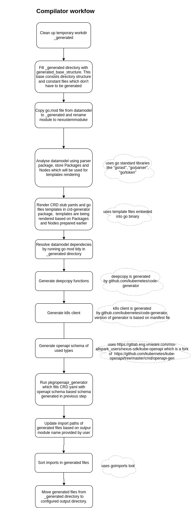

# nexus compiler
[](https://github.com/vmware-tanzu/graph-framework-for-microservices/actions/workflows/build.yml)

Nexus compiler main responsibility is to generate code based on provided datamodel. Currently, generated are:
- CRD yamls with OpenAPI schema,
- CRD Go types definitions,
- CRD Go clients,
- nexus shim layer.

# How compiler works

1. Compiler operates on datamodel provided by user (example can be found in `example/datamodel`).
2. Compiler parses datamodel to build graph (this happens in the `parser` package).
3. Based on built graph base templates are rendered and created (this happens in the `pkg/generator` package),
example output of this operation is in the `example/output/_rendered_templates` directory.
4. kubernetes code generator generates more additional Go code (this happens in the `generated_base_structure/scripts/generate_k8s_api.sh`),
it generates kuberentes go-client and deepcopy functions, example output is in
`example/crd-generated/client and example/crd-generated/apis/{api_name}/v1/zz_generated_deepcopy.go`.
5. OpenAPI generator updates CRD yamls with OpenAPI specification (this happens in the `generated_base_structure/scripts`,
uses k8s.io/kube-openapi/cmd/openapi-gen and code from some our custom logic in the `generated_base_structure/openapi_generator` package),
example output is in the `example/output/generated/crds`.

Very detailed flow chart
<p align="center"></p>

# Run compiler in container

1. Create datamodel based on [docs](https://gitlab.eng.vmware.com/nsx-allspark_users/nexus-sdk/docs/-/blob/master/getting_started/WorkingWithDatamodel.md)
2. Download compiler image or build in compiler repo using `make docker.builder && make docker` command
3. Run compiler from your application nexus directory. Specify GROUP_NAME env variable with your CRD group name:
Your datamodel should be mounted to /go/src/github.com/vmware-tanzu/graph-framework-for-microservices/compiler/datamodel directory, and directory to
which you would like to generate your files should be mounted to /go/src/github.com/vmware-tanzu/graph-framework-for-microservices/compiler/generated
directory. CRD_MODULE_PATH env var will determine import paths for generated files.
If you follow structure from example above you just need to specify GROUP_NAME and copy rest of following example
command
```
$ cd nexus
$ GROUP_NAME=helloworld.com && \
docker run  \
 --volume $(realpath .)/datamodel:/go/src/github.com/vmware-tanzu/graph-framework-for-microservices/compiler/datamodel  \
 --volume $(realpath .)/generated:/go/src/github.com/vmware-tanzu/graph-framework-for-microservices/compiler/generated \
 -e CRD_MODULE_PATH=$(go list -m)/nexus/generated/ \
 -e GROUP_NAME=$GROUP_NAME  \
 --workdir /go/src/github.com/vmware-tanzu/graph-framework-for-microservices/compiler/ \
  nexus-compiler:1ce29d44
```

# Run compiler locally

1. Create datamodel based on [docs](https://gitlab.eng.vmware.com/nsx-allspark_users/nexus-sdk/docs/-/blob/master/getting_started/WorkingWithDatamodel.md)
2. Init submodules by running `make init_submodules` (step required only once)
3. Install necessary tools by running `make tools` (step required only once)
4. Specify required env variables:
- `DATAMODEL_PATH` - path to datamodel
- `CONFIG_FILE` - path to config file
- `GENERATED_OUTPUT_DIRECTORY` - path to which code should be generated
- `CRD_MODULE_PATH` - name of module to which code should be generated
5. Run `make generate_code`
For example to generate code for org-chart datamodel example download it your GOPATH/src/gitlab.eng.vmware.com/nsx-allspark_users/nexus-sdk/datamodel-examples/ and
run compiler like this:
```
DATAMODEL_PATH=${GOPATH}/src/gitlab.eng.vmware.com/nsx-allspark_users/nexus-sdk/datamodel-examples/org-chart \
CONFIG_FILE=${DATAMODEL_PATH}/nexus.yaml \
GENERATED_OUTPUT_DIRECTORY=${DATAMODEL_PATH}/build \
CRD_MODULE_PATH=gitlab.eng.vmware.com/nsx-allspark_users/nexus-sdk/datamodel-examples.git/org-chart/build \
 make generate_code
```

# Development
## Guidelines

Any and every code change MUST follow code style guidelines and pass following checks:

- Unit Test cases are mandatory for any and every code change.

- `make test-fmt` - makes sure code formatting matches standard golang formatting

- `make lint` and `make vet` - static code analysis looking for possible programming errors, bugs, stylistic errors, and suspicious constructs

- `make race-unit-test` - executes unit tests with race flag to look for possible race conditions

## Build
### Build in containerized sandbox

To run build in a fixed/sandboxed environment:

1. Download the build sandbox: `make docker.builder`

2. Build nexus compiler: `make docker`

### Generate code for example datamodel in custom/local environment

Install required tools using `make tools`

To render templates for example datamodel use `make render_templates` (this step executes steps 1-3 from
[How compiler works](#How compiler works)). This will generate rendered templates to `example/output/_rendered_templates` directory.
To generate all code for example use `make generate_example` (this step executes all steps from
[How compiler works](#How compiler works)). This will generate code to `example/output/generated` directory.

## Test
### Run tests in containerized sandbox (Recommended)

To run tests in a fixed/sandboxed environment:

1. Download the test sandbox: `make docker.builder`

2. Test nexus compiler: `make test_in_container`

3. Test generation with `make test_generate_code_in_container`

### Test CRD templates rendering:

To render crd templates you can run:
`make render_templates`

This will generate rendered templates to `example/output/_rendered_templates` directory. This directory can be used for unit tests.

### Test whole code generation:

To test code generation for example datamodel run:
`make generate_example`

This will generate code to `example/output/generated` directory.

# Packaging

nexus compiler is packaged and published a Docker container images.

Packaging is achieved by the following two steps:
## Creating a base image

Create base image: `make docker`


## nexus compiler image

To build nexus compiler docker image: `make docker`

# Publishing

nexus compiler docker image can be published by invoking: `make publish`

# Known issues

### External types which don't implement DeepCopy methods are not supported.
If generated code can't be built with error message like
```bash
apis/root.tsm.tanzu.vmware.com/v1/zz_generated.deepcopy.go:173:6: in.F.DeepCopyInto undefined (type text.Frame has no field or method DeepCopyInto)
```
It means that text.Frame must implement DeepCopyInto method. This method must be added manually.
