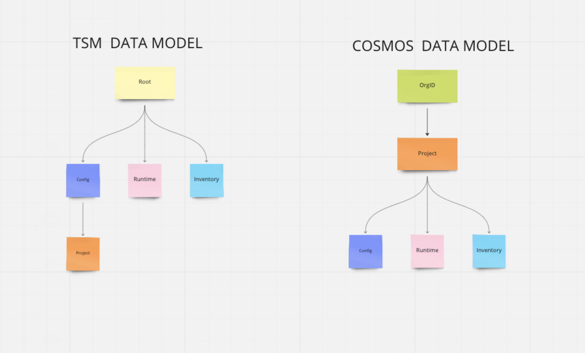

# Nexus DSL Support for Cosmos Datamodel

## Annotations

Nexus DSL support following annotation

- nexus-alias-name
- nexus-alias-type
- nexus-graphql-args
- nexus-graphql-nullable
- nexus-graphql-ts-type
- nexus-graphql-jsonencoded
- nexus-graphql-relation-name
- nexus-graphql-relation-parameters
- nexus-graphql-relation-uuidkey
- nexus-graphql-type-name
- nexus-graphql-protobuf-name
- nexus-graphql-protobuf-file


## nexus-alias-name:

Nexus DSL provide field name alias using nexus annotation `nexus-alias-name:"value"`
This annotation is used to alias the GraphQL field name

**_SYNTAX:_** `nexus-alias-name:"value"`
### Example:
Here's an example of Nexus DSL using the nexus-alias-name annotation

**Nexus DSL**

```go
type GNS struct {
    ApiDiscovery                gns_api_disc.ApiDiscovery           `nexus:"children"`
    GeoDiscovery                gns_geo_disc.GeoDiscovery           `nexus:"children" nexus-alias-name:"GeoDiscovery"`
}
```

This is the generated output GraphQL schema.

**GraphQL Schema**

```graphql
type GNS {
    apiDiscovery(id: ID): [ApiDiscovery!]
    GeoDiscovery(id: ID): [GeoDiscovery!]
}
```

## nexus-alias-type:

Nexus DSL provide field type alias using nexus annotation `nexus-alias-type:"value"`
This annotation is used to alias the GraphQL type (example: GraphQL Enums).

**_SYNTAX:_** `nexus-alias-type:"value"`
### Example:
Here's an example of Nexus DSL using the nexus-alias-type annotation

**Nexus DSL**

```go
type MetricMonitor struct {
    SvcMetric    string `nexus-alias-type:"ServiceMetricTypeEnum"`
    FunctionType string `nexus-alias-type:"MetricMonitorFunction"`
}
```
This is the generated output GraphQL schema.

**GraphQL Schema**

```graphql
type MetricMonitor {
    svcMetric: ServiceMetricTypeEnum
    functionType: MetricMonitorFunction
}
```
## nexus-graphql-args:

Nexus DSL supports configuring GraphQL filter parameters (arguments as key: value) using nexus annotation.

**_SYNTAX:_**  `nexus-graphql-args:"key: value"`

Filter parameters are only supported for fields with object types that are lists, and if no annotation is provided, the default value is set to (id: ID).

### Example:
Here's an example of Nexus DSL using the nexus-graphql-args annotation.

**Nexus DSL**

```go
type Service struct {
    ServiceVersions global_service_version.ServiceVersion `nexus:"children" nexus-graphql-args:"name: String"`
}
```

This is the generated output GraphQL schema.

**GraphQL Schema**

```graphql
type Service {
    serviceVersions(name: String): [ServiceVersion!]
}
```

## nexus-graphql-nullable:

In GraphQL, a non-nullable field is one that must always have a value and it is represented using an exclamation mark (`!`) after the field type.
Nexus DSL supports GraphQL `non-nullable` fields using nexus annotation `nexus-graphql-nullable`

Nexus DSL provide support for GraphQL `non-nullable` field. In the type language, we'll represent those with an exclamation mark `!`.
Nexus DSL can configure `non-nullable` field using nexus annotation

**_SYNTAX:_** `nexus-graphql-nullable:"false"`

"By default, all fields are nullable. To make a field non-nullable, add an annotation with the value false."

### Example:
Here's an example of Nexus DSL using the nexus-graphql-nullable annotation

**Nexus DSL**

```go
type GNSRoutingConfig struct {
    Name string `nexus-graphql-nullable:"false"`
}
```

This is the generated output GraphQL schema.

**GraphQL Schema**

```graphql
type GNSRoutingConfig {
    name: String!
}
```

## nexus-graphql-ts-type

This annotation is used to specify typescript file where the type is stored.

**_SYNTAX:_** `nexus-graphql-ts-type:"value"`

### Example:
Here's an example of Nexus DSL using the nexus-graphql-ts-type annotation

**Nexus DSL**

```go
type AdditionalAttributes struct {
    Name    string         `json:"name" yaml:"name"`
    Value   AttributeValue `nexus-graphql-ts-type:"./common/ts/common.d.ts"`
    Context string         `json:"context" yaml:"context"`
}
```
This is the generated output GraphQL schema.

**GraphQL Schema**

```graphql
type AdditionalAttributes {
    id: ID
    name: String
    value: String @jsonencoded(gofile:"model.go", name:"AttributeValue", file:"./common/ts/common.d.ts")
    context: String
}
```

## nexus-graphql-jsonencoded
This annotation is used to add empty jsonencoded annotation to generated GraphQL schema.

**_SYNTAX:_** `nexus-graphql-jsonencoded:""`

### Example:
Here's an example of Nexus DSL using the nexus-graphql-jsonencoded annotation

**Nexus DSL**
```go
type Annotation struct {
    nexus.Node
    Data string `nexus-graphql-jsonencoded:""`
}
```
This is the generated output GraphQL schema.

**GraphQL Schema**

```graphql
type Annotation {
    id: ID
    data: String @jsonencoded
}
```
## nexus-graphql-relation-name
This annotation is used to add `@relation` directive with a `name` parameter to generated GraphQL schema.

**_SYNTAX:_** `nexus-graphql-relation-name:"value"`

NOTE: If this is a link relation then `softlink: "true"` will be added to @relation directive.

### Example:
Here's an example of Nexus DSL using the nexus-graphql-relation-name annotation

**Nexus DSL**
```go
type ClusterConfigFolder struct {
    nexus.Node
    Clusters ClusterSettings `nexus:"children" nexus-graphql-relation-name:"HAS"`
}
```
This is the generated output GraphQL schema.

**GraphQL Schema**

```graphql
type ClusterConfigFolder {
    id: ID
    clusters(name: ID): [ClusterSettings!] @relation(name:"HAS")
}
```
## nexus-graphql-relation-parameters
This annotation is used to add `parameter` parameter to existing @relation directive or to create a new one in generated GraphQL schema.

**_SYNTAX:_** `nexus-graphql-relation-parameters:"value"`

NOTE: If this is a link relation then `softlink: "true"` will be added to @relation directive.

### Example:
In this case we want to add `parameters` to existing @relation directive.

**Nexus DSL**
```go
type ClusterConfigFolder struct {
    nexus.Node
    Clusters ClusterSettings `nexus:"children" nexus-graphql-relation-name:"HAS" nexus-graphql-relation-parameters:"ClusterSettingsStatus"`
}
```
This is the generated output GraphQL schema.

**GraphQL Schema**

```graphql
type ClusterConfigFolder {
    id: ID
    clusters(name: ID): [ClusterSettings!] @relation(name:"HAS", parameters:ClusterSettingsStatus)
}
```

## nexus-graphql-relation-uuidkey
This annotation is used to add `uuidkey` parameter to existing @relation directive or to create a new one in generated GraphQL schema.

**_SYNTAX:_** `nexus-graphql-uuidkey:"value"` (value: true or false)

NOTE: If this is a link relation then `softlink: "true"` will be added to @relation directive.

### Example:
In this case we want to add `parameters` to existing @relation directive.

**Nexus DSL**
```go
type AppGroup struct {
    nexus.Node
    Services Service      `nexus:"links" nexus-graphql-relation-uuidkey:"true"`
}

```

**GraphQL Schema**

```graphql
type AppGroup {
    name: ID
    services(name: String): [Service!] @relation(softlink: "true", uuidkey:"true")
}
```

## nexus-graphql-type-name
This annotation is used to create new Go alias type for external types.

**_SYNTAX:_** `nexus-graphql-type-name:"value"`

### Example:
In this case we specify type-name as `PolicySpec`. Compiler will add a new Go type with the name `PolicySpec` which will point to `istioauthv1alpha1.Policy`

**Nexus DSL**
```go
type AuthenticationPolicy struct {
    nexus.Node
    Spec        istioauthv1alpha1.Policy `nexus-graphql-ts-type:"./root/inventory/cluster/domain/authentication-policy/istio.d.ts" nexus-graphql-type-name:"PolicySpec"`
}
```

**Generated alias type**
```go
type PolicySpec istioauthv1alpha1.Policy
```

**GraphQL Schema**
```graphql
type AuthenticationPolicy {
    id: ID
    spec: String @jsonencoded(gofile:"model.go", name:"PolicySpec", file:"./root/inventory/cluster/domain/authentication-policy/istio.d.ts")
}
```

## nexus-graphql-protobuf-name
This annotation is used to add @protobuf directive with a `name` parameter to generated graphql schema.

**_SYNTAX:_** `nexus-graphql-protobuf-name:"value"`

### Example:
Here's an example of Nexus DSL with the nexus-graphql-protobuf-name annotation.
**Nexus DSL**
```go
type ExternalPluginCapability struct {
    nexus.Node
    Capability string `nexus-graphql-protobuf-name:"RegisterCapabilityArguments"`
}
```

**GraphQL Schema**
```graphql
type ExternalPluginCapability {
    id: ID
    capability: String @protobuf(name:"RegisterCapabilityArguments")
}
```
## nexus-graphql-protobuf-file
This annotation is used to add `file` parameter to existing @protobuf directive or to create a new one in generated graphql schema.

**_SYNTAX:_** `nexus-graphql-protobuf-file:"value"`

### Example:
Here's an example of Nexus DSL with the nexus-graphql-protobuf-file annotation.
**Nexus DSL**
```go
type ExternalPluginCapability struct {
    nexus.Node
    Capability string `nexus-graphql-protobuf-name:"RegisterCapabilityArguments" nexus-graphql-protobuf-file:"./common-apis/protos/external-plugin/ep-server.proto"`
}
```

**GraphQL Schema**
```graphql
type ExternalPluginCapability {
    id: ID
    capability: String @protobuf(name:"RegisterCapabilityArguments", file:"./common-apis/protos/external-plugin/ep-server.proto")
}
```

# Nexus GraphQL Spec

Nexus GraphQl spec is to specify a node level attribute: ie. what is the name of the ID field and is the ID field nullable.

```go
type GraphQLSpec struct {
   IdName     string.       <--- default is empty string. In which case we assume "id"
   IdNullable bool          <--- default is true. In which case is will be nullable.
}
```

### Example-1:
**Default behavior**

Nexus Node will be annotate as `nexus.Node` and it is generated as `id: ID` in GraphQL schema

**Nexus DSL**

```go
type Foo1 struct {
    nexus.Node
}
```

**GraphQL Schema**

```graphql
type Foo1 {
    id: ID
}
```

### Example-2:
Here is an example of Nexus DSL with support of Nexus GraphQL spec

Nexus GraphQl Spec is used to modify the default behavior

**Nexus DSL**

```go
var Foo1GraphqlSpec = GraphQLSpec{
    IdName: "name",
    IdNullable: false,
}

// nexus-graphql-spec:Foo1GraphqlSpec
type Foo1 struct {
    nexus.Node
}
```

**GraphQL Schema**

```graphql
type Foo1 {
    name: ID!
}
```

## Inferences/Assumptions

**1) Arguments**

Every field on a GraphQL object type can have zero or more arguments,

but in Nexus we support filter params for only GraphQL field with list object type (children,links) can have arguments.

### Example:
**CHILDREN**

```go
type AppFolder struct {
    nexus.Node
    App global.App `nexus:"children" nexus-graphql-args:"name: ID"`
}
```

```graphql
type AppFolder {
    id: ID
    app(name: ID): [App!]
}
```

**LINKS**

```go
type AppGroup struct {
    nexus.Node
    Services global.Service `nexus:"links" nexus-graphql-args:"name: String" nexus-graphql-tsm-directive:"@relation(softlink: \"true\", uuidkey: \"true\")"`
}
```

```graphql
type AppGroup {
    name: ID
    services(name: String): [Service!]
        @relation(softlink: "true", uuidkey: "true")
}
```

## Changes

Nexus Compiler will generate GraphQL node name as combination of (PkgName+NodeName) to avoid name collision.


example:

**DSL:**

```go
package root

type Root struct {
  Name string
}
```

**GraphQL Schema**

```graphql
type root_Root {
    name: String
}
```

For Cosmos DM we modified the nexus compiler to generate Name from
`root_Root` type name to `Root` by defining the node in `global` package
Nexus compiler will skip the package name, if node is defined in `global`

lib-ts expects `Root` as root node.

FROM

```graphql
type Query {
    root: root_Root
}

type root_Root {
    Id: ID
    Name: String
}
```

TO

```graphql
type Query {
    root: Root
}

type Root {
    id: ID
    name: String
}
```

## Limitations

**Enums**

Nexus DSL doesn't support enums, so all enums should be defined in file `cosmos-datamodel/common/enums.graphql`

**Link property schema**

Soft links/ Hard links property are Non nexus nodes, they are defined in file `cosmos-datamodel/common/parameters.graphql`

# Developer Workflow:

Developers can follow listed steps to modify Cosmos DM using Nexus DSL:

## STEP-1: Modify Datamodel

Cosmos Datamodel DSL is defined in directory `cosmos-datamodel`

## STEP-2: Build Datamodel

```bash
make datamodel_build
```

Make target `datamodel_build` will generate GraphQL schema and output file are copied into directory `schemas/datamodel/schema.graphql` and generated model.go is copied into directory `schemas/datamodel/common/go`

## STEP-3: Commit the change and Raise MR

In Step-2 GraphQL schema is generated and copied into datamodel path
Now commit your generated GraphQL Schema changes and raise MR, It will trigger CI pipeline to build `common-api` package.


# How Backward compatibility b/w TSM & Cosmos DM is handled

We have a bash script that will run internally during the make datamodel build to patch the generated GraphQL schema and manage backward compatibility between TSM and Cosmos datamodel.
Location of script:  `cosmos-datamodel/patch-schema-graphql.sh`



