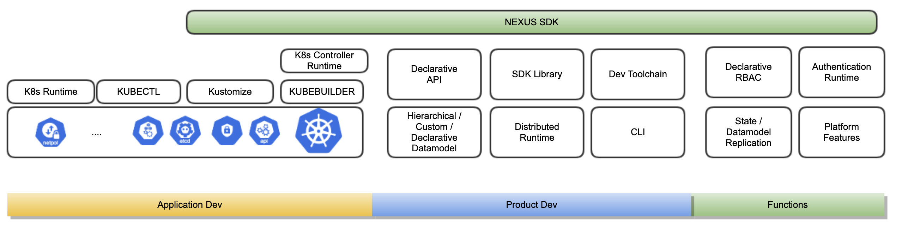
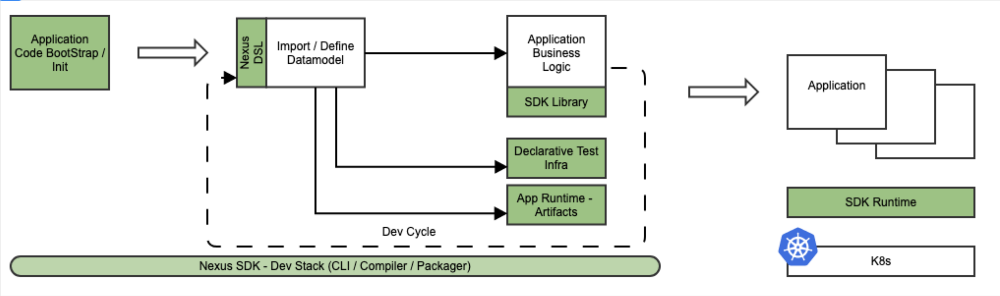

# Nexus SDK

Nexus SDK is a platform, framework and runtime that provides an extensible, distributed stack that:
* accelerates cloud native application development
* simplifies consumption
* provides a out-of-the-box platform that is distributed, consistent, stable and feature rich
* provides a plug-and-play runtime for core platform functions

### [Get Started](getting_started/README.md)

## What are we trying to solve ?

The need for an unified SDK for quickly and easily building and provisioning a platform built for today's Cloud Native applications and products.

A [plethora of tools](https://collabnix.github.io/kubetools/), utilities and framwork have cropped up around kubernetes that aim to abstract and simplify different aspects of K8s.

What our products (and many products) need are contracts, not tools. 
A unified framework that provides:

* API declaration, API endpoint management, versioning, packaging, rollout and more
* a hierarchical datamodel that is declarative, consistent, custom built and configurable
* API first design, with support for APIs beyond CRD's: graphql, custom REST API/URL etc
* an integrated RBAC that can be versioned, codified
* a distributed runtime, with API Gateway, that will seamlessly stretch across product boundaries and cluster boundaries
* toolchain to aid, fast-track application development
* a programmatic library to provide a cloud native development paradigm
* a single tool to hold all of the above together

In essence, what products want is not K8s, not be limited by K8s, but rather to build on top of K8s.

Nexus SDK is our answer to these prayers :tada: :innocent:

## What's in the box ?

* [Simple / intuitive DSL](Datamodel/DSL/README.md) to specify Nexus Datamodel.
* [Nexus compiler](.content/images/NexusCompiler.png) that understands Nexus DSL and generates datamodel spec and libraries.
* Nexus Datamodel implementation using K8s CRDs.
* [Nexus runtime](design/Nexus-Runtime.md) to host Nexus Datamodel.
* Ability to consume Nexus Datamodel using standard / opensource K8s libraries.
* [Nexus CLI](design/NexusCLI.md) that is a command line interface that is uber utility to interface with framework and SDK.

## Typical Application Workflow

## **Nexus SDK Sessions Recordings**

Please follow this link if you would like to understand and deep dive into the nexus SDK and its components.

https://confluence.eng.vmware.com/pages/viewpage.action?spaceKey=NSBU&title=Nexus+SDK+Recordings

## Support

Reach out to Platform Team on [#nexus-sdk](https://vmware.slack.com/archives/C017KTHQ10X) slack channel for additional info and support.
