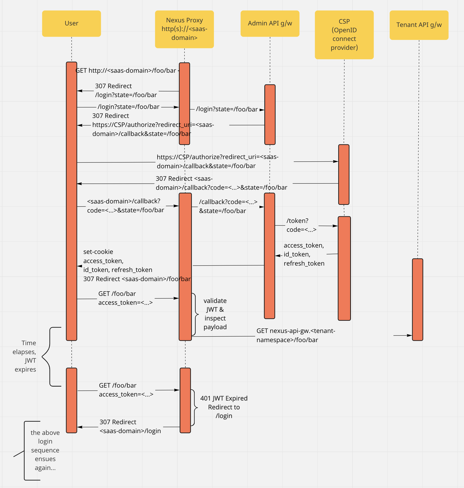

# Nexus Runtime

# Nexus Admin Runtime

Admin runtime provides a runtime manifest to install components required to provide administrative features from nexus platform, that products can depend on and reuse.

Admin functions include:

* CSP integration - Authn, Authz
* Declarative API infrastructure
* Persistent datamodel / datastore
* Pub / Sub interface for datamodel
* Dynamic / programmable routing for incoming requests based on:
    * license
    * sku
    * geo
resources
etc ...

### Overview
The Nexus admin runtime is very similar to a standard Nexus tenant runtime but with a few small differences:
* The *nexus-api-gw* is configured to be in `admin` mode ([more on that later](#Admin Mode)) 
* There's an envoy proxy that serves as the entry point for all requests to the Nexus deployment

#### Role of Nexus proxy
The Envoy proxy is configured such that:
* a request to /foo/bar, if unauthenticated (missing JWT token or on being presented an expired/invalid JWT token, is proxied to `nexus-api-gw/login`. The api-gw then proceeds with the [OIDC flow](../getting_started/ApiGwOIDC.md).
* after authenticating with the IDP, the user is redirected back to the OAuth2 callback URL. envoy is programmed to proxy requests to the callback path to the api-gw. The api-gw then exchanges the authorization code for an access/id/refresh token and sets them as cookies. As a result, all subsequent requests will carry the authentication information. The [diagram below](#Authentication Workflow) captures the sequence described here.
* envoy is programmed with information about where to fetch the IDP's signing keys and is programmed to verify the JWTs received as part of an `Authorization` header or as part of an `access_token` cookie.
* after the JWT token is verified, envoy routes to the appropriate upstream tenant based on a specified claim in the JWT
* header-based routing is also supported

The envoy proxy is programmed to receive configuration from an [xDS](https://www.envoyproxy.io/docs/envoy/latest/api-docs/xds_protocol) server that resides within the api-gw. The api-gw itself configures itself based on the [Nexus API Datamodel](https://gitlab.eng.vmware.com/nsx-allspark_users/nexus-sdk/api).

Instructions to install the Nexus admin runtime can be found [here](../getting_started/AdminRuntimeInstall.md)

#### Admin Mode
* In the admin mode, the authentication middleware on the REST endpoints is not registered since envoy is configured to handle authentication

## Authentication Workflow

## Installation Workflow

# API Workflow

