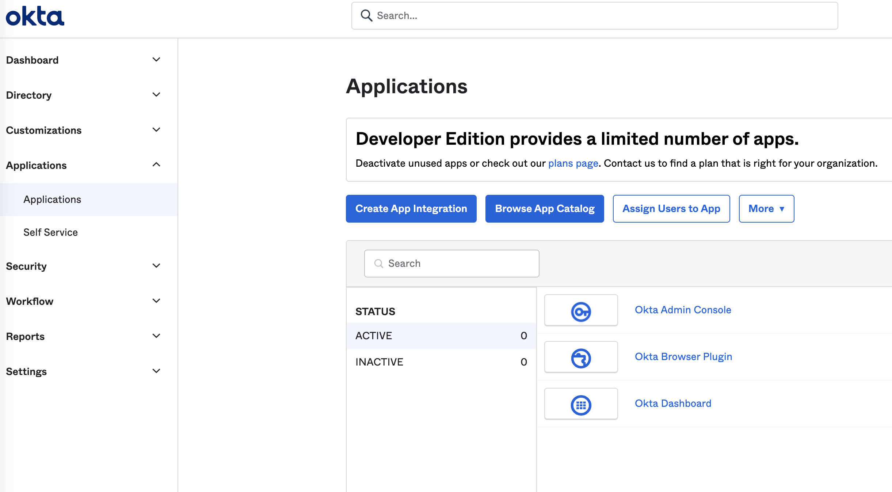
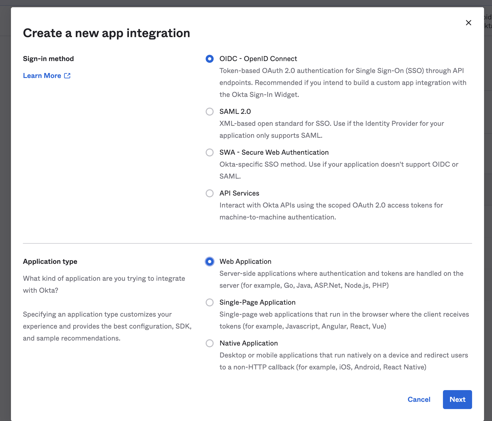
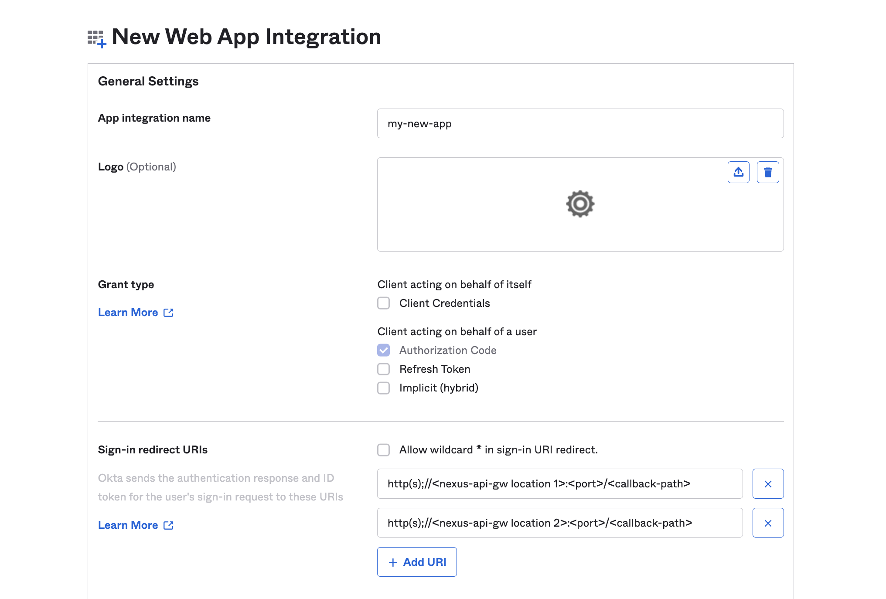
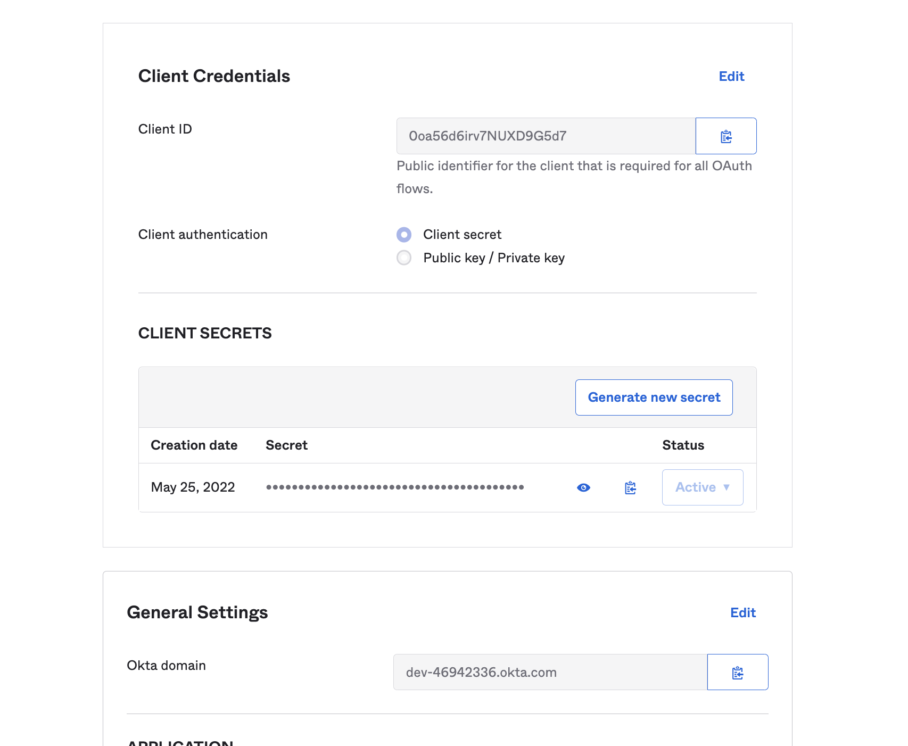

## Configuring OIDC authentication on the Nexus API Gateway

[Here's](https://video.eng.vmware.com/videos_embed/6024dbfd-7669-41f0-aaab-c6c5b7c675bf) a brief overview and a demo of the Nexus API Gateway's OIDC authentication feature.

This feature is available with Nexus CLI versions `>= v0.0.42`

### Overview
The Nexus API Gateway supports OpenID connect's *Authorization Code* flow. For a concise introduction to OAuth and OIDC, you can read [this](https://developer.okta.com/docs/concepts/oauth-openid/) page.

This image summarizes the flow of requests between the user, the api-gw (denoted as **Web App** in the diagram below) and the auth-server.


#### The Nexus API Gateway API
One of the responsibilities of the Nexus API Gateway is to authenticate requests. We support OpenID Connect as the authentication protocol. As illustrated in the diagram above, the api-gw checks for if the request is authenticated and if it isn't, redirects the user to an OIDC authorization server. Once the user completes authentication, the user is redirected back to the api-gw (to the configured OAuthRedirect URL). The api-gw then exchanges the "authorization code" for access/id/refresh tokens and sets these tokens as cookies. As a result, subsequent requests to the api-gw carry the tokens. The api-gw validates these tokens on every incoming request. This behaviour is consistent with [TSM's api-gw](https://gitlab.eng.vmware.com/nsx-allspark_users/api-gw).

The following endpoints are configured on the API g/w as a result of enabling OIDC:
```
# Performs the login flow and sets the tokens as cookies and returns tokens as headers
# Supports any http method so that a login is possible from a browser (Is this OK?)
Any /login

# Logs the user out by making a logout call to the auth server and clearing the cookies
POST /logout

# Uses the refresh token (if available) to fetch a fresh set of tokens
POST /refreshTokens

# Provided as input as part of the OIDC node (see below)
Any /<callback-url> 
```

The Nexus API g/w is a *Nexus* app and, like all nexus apps, relies on a datamodel for configuration. The Nexus API datamodel is located [here](https://gitlab.eng.vmware.com/nsx-allspark_users/nexus-sdk/api).

To configure OpenID-connect on the Nexus API gateway, you need to configure the `nexus/config/apigateway/oidc` node

### Getting Started
##### Deploy a test application with REST endpoints exposed
We'll use the [OrgChart](./WorkingWithCommonDatamodel.md) app as an example. Follow the workflow to deploy the app. 

By the end of the workflow, you should be able to retrieve the leader created:

##### Port-forward the api-gw to get access to the nexus-api-server and REST endpoints
```shell
kubectl port-forward svc/nexus-api-gw 5000:80 -n ${NAMESPACE}
```

```shell
curl http://localhost:5000/leaders
```

##### Configure OIDC
For the purposes of this example, we'll create empty `Nexus`, `Config` and `ApiGateway` nodes.

```shell
kubectl apply -s localhost:5000 -f - <<EOF
apiVersion: api.nexus.vmware.com/v1
kind: Nexus
metadata:
  name: default
---
apiVersion: config.nexus.vmware.com/v1
kind: Config
metadata:
  name: default
  labels:
    nexuses.api.nexus.vmware.com: default
---
apiVersion: apigateway.nexus.vmware.com/v1
kind: ApiGateway
metadata:
  name: admin
  labels:
    nexuses.api.nexus.vmware.com: default
    configs.config.nexus.vmware.com: default
spec:
  mode: tenant
EOF
```

Create the OIDC node for an [Okta](https://www.okta.com/openid-connect/) OIDC app.

Follow the instructions [here](https://help.okta.com/en/prod/Content/Topics/Apps/Apps_App_Integration_Wizard_OIDC.htm) to create an OIDC app on Okta

<details>
The following screenshots may help:

##### Click Create App Integration


##### Create Web App with OIDC


##### Configure Redirect URIs to be the URL(s) where the API gateway can be reached


##### Download Client ID, Secret and Domain

</details>

```shell
# Okta
kubectl apply -s localhost:5000 -f - <<EOF
apiVersion: authentication.nexus.vmware.com/v1
kind: OIDC
metadata:
  name: okta
  labels:
    nexuses.api.nexus.vmware.com: default
    configs.config.nexus.vmware.com: default
    apigateways.apigateway.nexus.vmware.com: default
spec:
  config:
    clientId: "XXX"
    clientSecret: "XXX"
    oAuthIssuerUrl: "https://dev-XXX.okta.com/oauth2/default"
    oAuthRedirectUrl: "http://<API-GW-DNS/IP>:<PORT>/<CALLBACK_PATH>"
    scopes:
      - openid
      - profile
      - offline_access
  validationProps:
    insecureIssuerURLContext: false
    skipIssuerValidation: false
    skipClientIdValidation: false
    skipClientAudValidation: false
EOF
```

At the moment, we support configuring exactly 1 IDP. If you want to switch to a different IDP, you will have to delete the existing OIDC node and then create a new one. You can delete existing OIDC nodes by following the instructions [here](#Disable-OIDC)

For a [CSP](https://console-stg.cloud.vmware.com/) OIDC app, we must disable validating a few claims since some CSP claims are non-standard. 

Instructions for creating an OIDC app on CSP can be found [here](https://confluence.eng.vmware.com/display/CSPSDD/Steps+to+Generate+Access+Token+by+Exchanging+Authorization+Code). For dev usage, you can create your own organization and app at the [CSP staging instance](https://console-stg.cloud.vmware.com). To create a CSP organization, follow the steps [here](http://cdickmann-calatrava-blog.calatrava.vmware.com/?blog=building-calatrava-blog-part2).

```shell
# CSP
kubectl apply -s localhost:5000 -f - <<EOF
apiVersion: authentication.nexus.vmware.com/v1
kind: OIDC
metadata:
  name: csp
  labels:
    nexuses.api.nexus.vmware.com: default
    configs.config.nexus.vmware.com: default
    apigateways.apigateway.nexus.vmware.com: default
spec:
  config:
    clientId: "XXX"
    clientSecret: "XXX"
    oAuthIssuerUrl: "https://console-stg.cloud.vmware.com/csp/gateway/am/api"
    oAuthRedirectUrl: "http://<API-GW-DNS/IP>:<PORT>/<CALLBACK_PATH>"
    scopes:
      - openid
      - profile
  validationProps:
    insecureIssuerURLContext: true
    skipIssuerValidation: true
    skipClientIdValidation: true
    skipClientAudValidation: true
EOF
```

#### Access a REST URI
You can access a REST URI on the API Gateway to see the OIDC Authentication in action.

You can try this URL, for instance:
```shell
open http://localhost:5000/leaders
```

#### Authenticating kubectl requests
TODO

##### Disable OIDC
To disable OIDC, simply delete the created OIDC node.
```shell
kubectl delete oidcs.authentication.nexus.vmware.com --all -s localhost:5000
```
