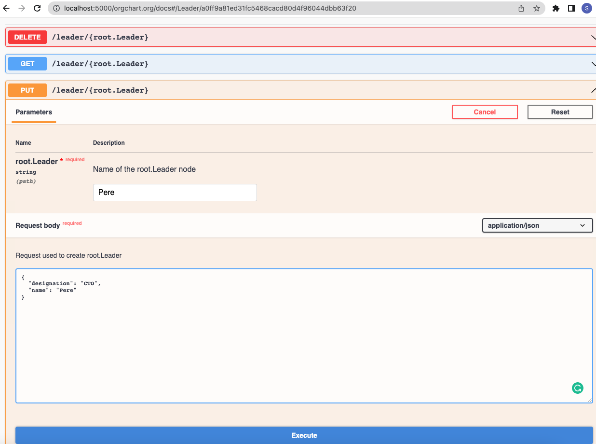
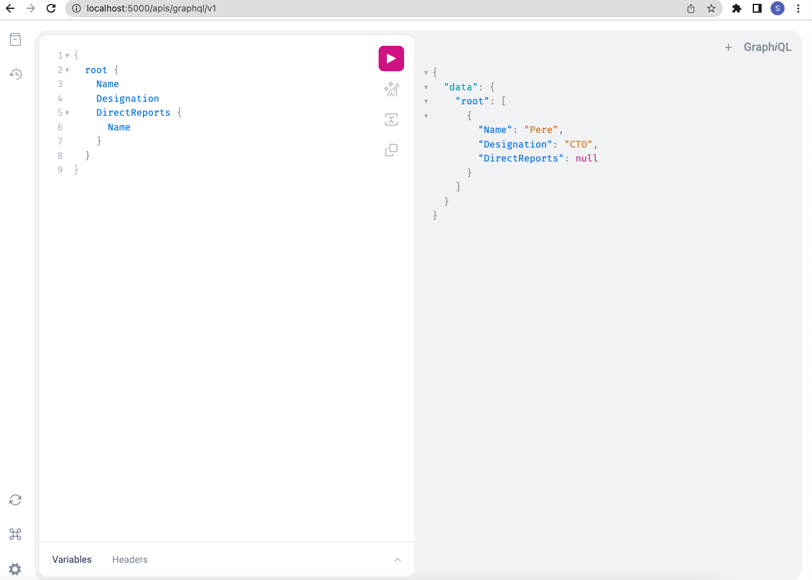
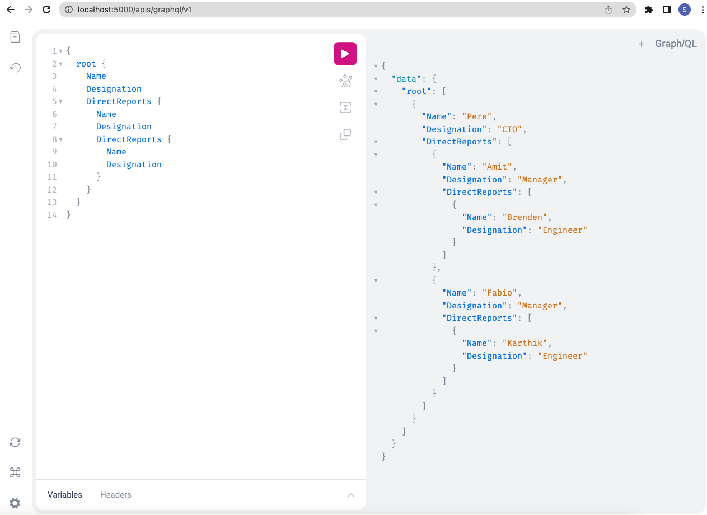

## App Datamodel Usage Workflow

This workflow will walk you through the steps to interact and work with your applocal datamodel.

* [Pre-requisites](AppDatamodelUsageWorkflow.md#pre-requisites)

* [Usage examples with Nexus Tools](AppDatamodelUsageWorkflow.md#usage-nexus-tools)


## Pre-requisites
1. This workflow requires Datamodel to be initialised and installed before proceeding to further steps. Please follow the below link to configure datamodel

    #### [Datamodel Workflow](DatamodelWorkflow.md)

<!--

1. This workflow requires the App should be initialised and configured before proceeding to further steps. Please follow the below link to configure the App

    #### [App Workflow](AppWorkflow.md)
-->

<!-- nexus-specific exports
```
# store the current directory before we `cd` into the app dir
export DOCS_INTERNAL_DIR=$PWD/docs/_internal
```
-->


## Usage examples with Nexus Tools

```
# Portforward the services Nexus API Gw and GraphQL to access the datamodel objects
kubectl port-forward svc/nexus-api-gw 5000:80 -n default &
```

###  Create Leader Object via REST API using Swagger UI

**GraphQL query to verify that leader doesn't exist**


<!--
```shell
 curl -X PUT -H 'Content-Type: application/json' -d '{"designation": "CTO","name": "Pere"}' http://localhost:5000/leader/Pere
```
-->
**Create a Leader object via REST API using Swagger UI**



**GraphQL query to verify the leader is properly**



<!--
```shell
curl -X POST -H 'Content-Type: application/json' -d '{"query":"{\nroot{\nName\n}\n}"}' http://localhost:5001/query
```
-->

### Create Manager Object via REST API using curl

```shell
curl -X POST -H 'Content-Type: application/json' -d '{"apiVersion":"root.orgchart.org/v1","kind":"Manager","metadata":{"labels":{"leaders.root.orgchart.org":"Pere"},"name":"Amit"},"spec":{"designation":"Manager","name":"Amit"}}'  http://localhost:5000/apis/root.orgchart.org/v1/managers -o /dev/null
```

**GraphQL query to verify the manager is properly created**


<!--
```shell
curl -X POST -H 'Content-Type: application/json' -d '{"query":"{root{Name \n Designation \n DirectReports {Name\nDesignation} }}"}' http://localhost:5001/query
```
-->

### Create another Manager Object via Kubectl

```shell
echo 'apiVersion: root.orgchart.org/v1
kind: Manager
metadata:
  name: Fabio
  labels:
    leaders.root.orgchart.org: Pere
spec:
  designation: Manager
  name: Fabio' | kubectl -s localhost:5000 apply -f -
```

**GraphQL query to verify the manager is created or not**


<!--
```shell
curl -X POST -H 'Content-Type: application/json' -d '{"query":"{root{Name \n Designation \n DirectReports {Name\nDesignation} }}"}' http://localhost:5001/query
```
-->

### Create Engineer Objects via nexus cli

```shell
echo 'apiVersion: root.orgchart.org/v1
kind: Engineer
metadata:
  name: karthik
  labels:
    leaders.root.orgchart.org: Pere
    managers.root.orgchart.org: Fabio
spec:
  designation: Engineer
  name: Karthik
---
apiVersion: root.orgchart.org/v1
kind: Engineer
metadata:
  name: brenden
  labels:
    leaders.root.orgchart.org: Pere
    managers.root.orgchart.org: Amit
spec:
  designation: Engineer
  name: Brenden' > engineers.yaml
```

```shell
nexus login -s localhost:5000 --in-secure
nexus apply -f engineers.yaml
```

**GraphQL query to verify the engineers is created or not**



<!--
```shell
curl POST -H 'Content-Type: application/json' -d '{"query":"{root{Name \n Designation \n DirectReports {Name\nDesignation\nDirectReports{\nName\n}} }}"}' http://localhost:5001/query
```
-->
