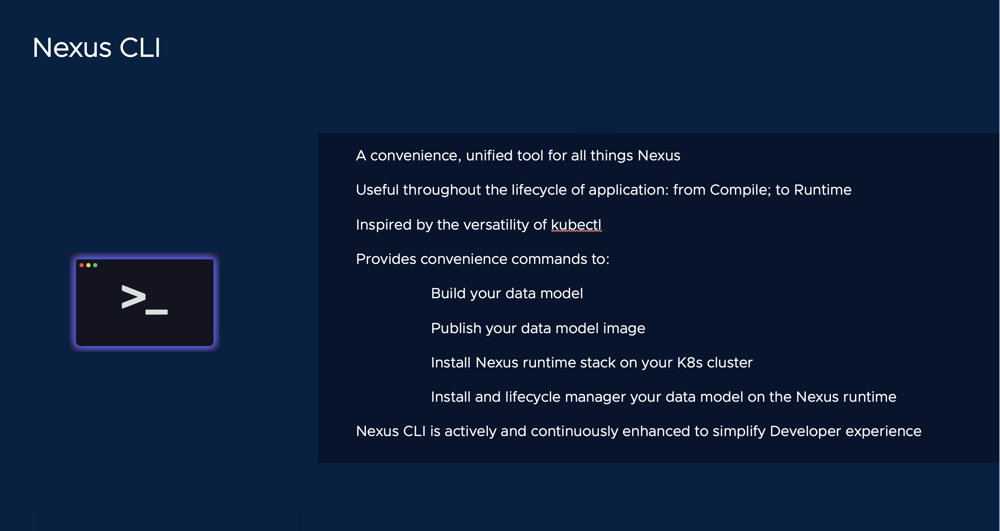

# Install Nexus CLI



[[Prev]](Playground.md) [[Exit]](../../README.md)  [[Next]](Playground-SockShop.md)

## 1. Download Nexus CLI

Let's start by installing Nexus CLI.

```
curl -fsSL https://raw.githubusercontent.com/vmware-tanzu/graph-framework-for-microservices/main/cli/get-nexus-cli.sh -o get-nexus-cli.sh
sudo bash get-nexus-cli.sh --no-prompt
```

<details><summary>FAQs</summary>
      
Nexus install with default settings and to default location
```
       ❯ sudo bash get-nexus-cli.sh --no-prompt
       Downloading Nexus ...
       Version: v0.0.149
       Image repository: gcr.io/nsx-sm/nexus/nexus-cli
       Directory: /usr/local/bin

       Nexus (v0.0.149) installed in /usr/local/bin/nexus
       Run "nexus help" to get started
```
	
Nexus install with user customization

```
	❯ sudo bash get-nexus-cli.sh
         Downloading Nexus ...
         Version: v0.0.149
         Image repository: gcr.io/nsx-sm/nexus/nexus-cli
         Directory: /usr/local/bin

         Would you like to customize installation [y/n]:
         y
         Image repository [gcr.io/nsx-sm/nexus/nexus-cli]:
         Version [v0.0.149]:v0.0.148
         Directory [/usr/local/bin]:
         Nexus (v0.0.148) installed in /usr/local/bin/nexus
         Run "nexus help" to get started
```
   
Nexus install with specfic version
```
	sudo bash get-nexus-cli.sh  -v v0.0.148
	```
	
    Nexus install with specfic version/Image/Directory	
	```
	sudo bash get-nexus-cli.sh -r gcr.io/nsx-sm/nexus/nexus-cli -v v0.0.148 -d /usr/local/bin
```
   
</details>
    
## 2. Verify your environment satisfies Nexus pre-requisites

```
nexus prereq verify
```

<details><summary>See Pre-requisites</summary>

    a. To list all relevant pre-requisites:

        nexus prereq list

</details>


[[Prev]](Playground.md) [[Exit]](../../README.md)  [[Next]](Playground-SockShop.md)