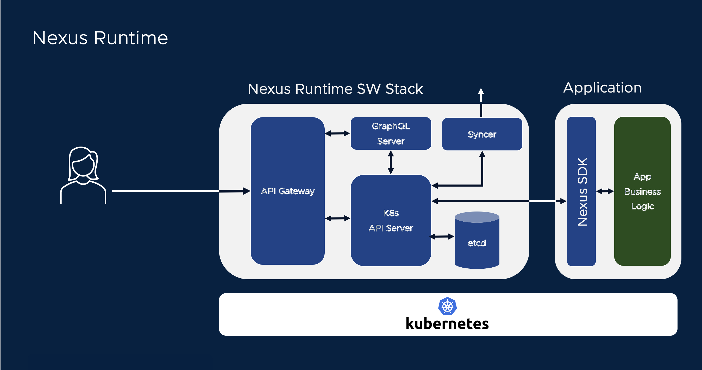
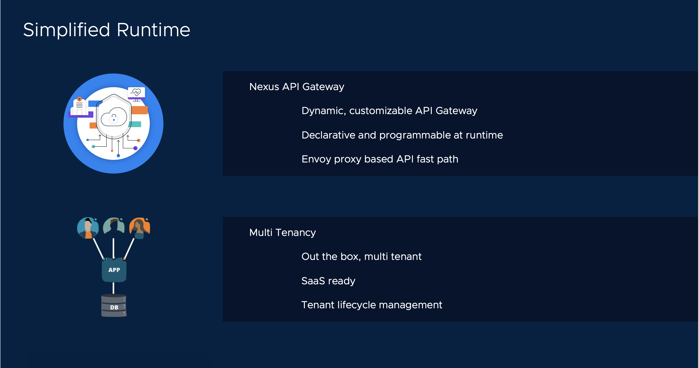
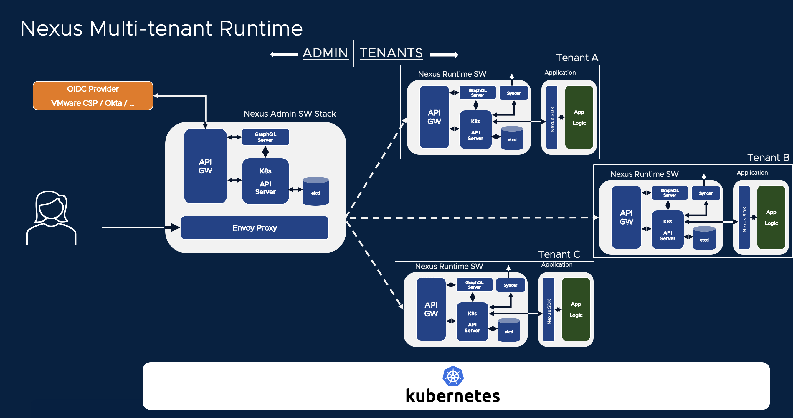
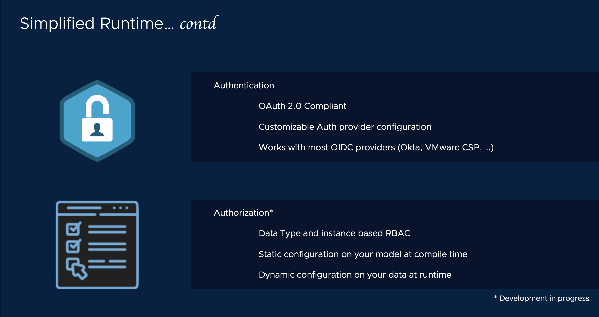

# Install Sock Shop data model on Nexus Runtime
[[Prev]](Playground-InstallCLI-Lite.md) [[Exit]](../../README.md)  [[Next]](Playground-SockShop-Lite.md)










Nexus data model is installed on a Nexus Runtime software stack.

### 1. Build Runtime Artifacts
#### Specify a tag to use for locally built runtime artifacts
```
# The tag can be anything. Here we use a tag called "letsplay"
echo letsplay > TAG
```
#### Start Build
```
make runtime.build
```

### 2. Install Runtime
```
make runtime.install.k0s
```
[[Prev]](Playground-InstallCLI-Lite.md) [[Exit]](../../README.md)  [[Next]](Playground-SockShop-Lite.md)