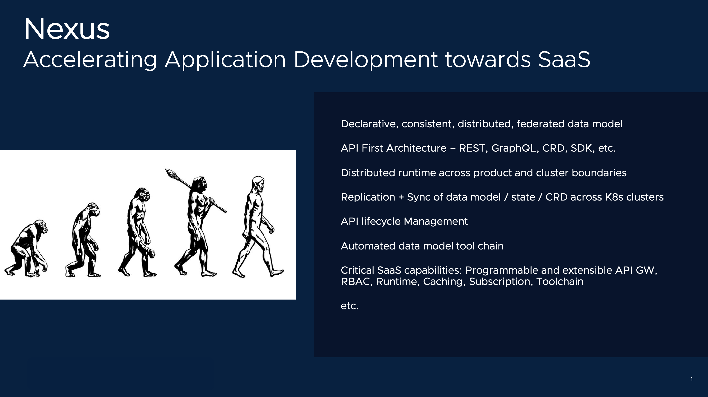

# Playground Lite

[[Exit]](../../README.md)  [[Next]](Playground-InstallCLI-Lite.md)

Welcome to the Nexus playground Lite.

This tutorial will walk you through the fundamental aspects of Nexus.

The goal is to give you a taste of the most interesting and impactful aspects of Nexus in the shortest possible time.

## Mission: Accelerating Application Development

SaaS is at the front and center of cloud strategy of many enterprises.

While this transformation is in full steam, enterprise applications have struggled to keep up with the pace.

SaaS is a long-term commitment, and applications on SaaS have to contend with distributed state, API centric workflows, continous upgrades, etc. The notion that we can simply package an application, deploy it on SaaS and call it a SaaS application is short-sighted.

We, in software industry, have gone to great lengths to abstract platform from business logic. The same level of diligence is also needed to keep the business logic abstracted from SaaS.

Nexus was created to stop this bleed.

Nexus provides core functions that are critical to SaaS applications, with clean abstractions and well-defined contracts. 

* It can bootstrap application data model in a matter of minutes.

* It provides API First experience in that, data model is readily available for consumption by REST, Graphql, SDK etc out-the-box.

* It replicates data model across multiple clusters and regions. So your state is available to you, where you need it, when you need it.

* It provides critical SaaS capabilities like API gateway, RBAC, subscription semantics, etc.

[[Exit]](../../README.md)  [[Next]](Playground-InstallCLI-Lite.md)
