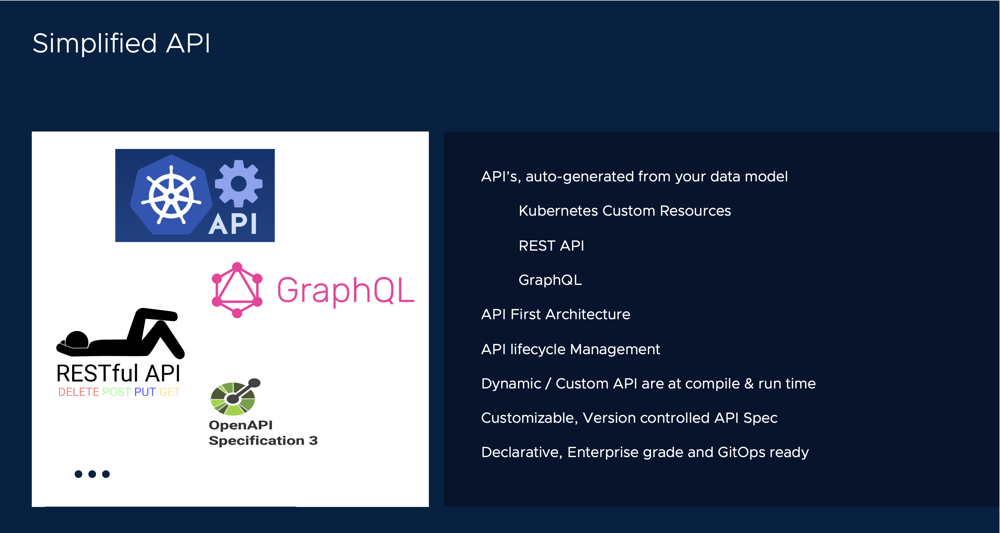

# Define Custom REST API's on the model; as needed



[[Prev]](Playground-SockShop-Relationships.md) [[Exit]](../../README.md) [[Next]](Playground-SockShop-Complete-Datamodel.md)


Your datamodel is out-the-box API ready.

If need be, you can specify custom REST API's on desired node types, in the model.

## Define custom REST API on the Socks type

We would like to expose Socks type in the model through 2 REST APIs:

```
	/socks/#name - GET, PUT, DELETE
	/socks - List
```

To achieve this, let's associate the following RESTAPISpec on the Socks type.

```
var SocksRestAPISpec = nexus.RestAPISpec{
	Uris: []nexus.RestURIs{
		{
			Uri:     "/sock/{root.Socks}",
			Methods: nexus.DefaultHTTPMethodsResponses,
		},
		{
			Uri:     "/socks",
			Methods: nexus.HTTPListResponse,
		},
	},
}

// nexus-rest-api-gen:SocksRestAPISpec
type Socks struct {
	nexus.Node

	Brand string
	Color string
	Size  int
}
```

## Define custom REST API on the Orders type

We would like to expose Orders type in the model through the following REST API:

```
	/Orders/#name - GET, PUT, DELETE
```

To achieve this, let'ss associate the following RESTAPISpec on the Orders type.

```
var OrderRestAPISpec = nexus.RestAPISpec{
	Uris: []nexus.RestURIs{
		{
			Uri:     "/order/{root.Orders}",
			Methods: nexus.DefaultHTTPMethodsResponses,
		},
	},
}

// nexus-rest-api-gen:OrderRestAPISpec
type Orders struct {
	nexus.Node

	SockName string
	Address  string

	Cart     Socks    `nexus:"link"`
	Shipping Shipping `nexus:"link"`
}
```
[[Prev]](Playground-SockShop-Relationships.md) [[Exit]](../../README.md) [[Next]](Playground-SockShop-Complete-Datamodel.md)
