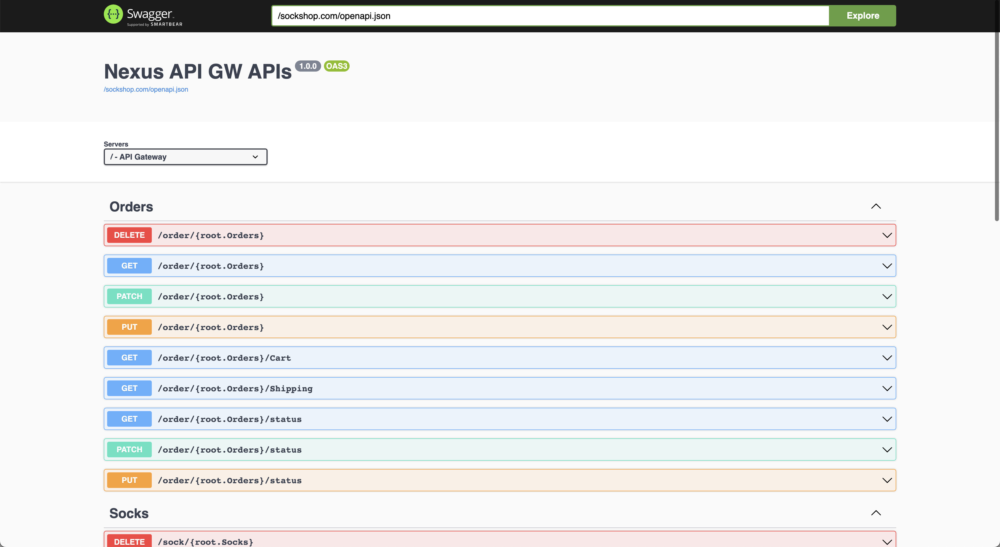
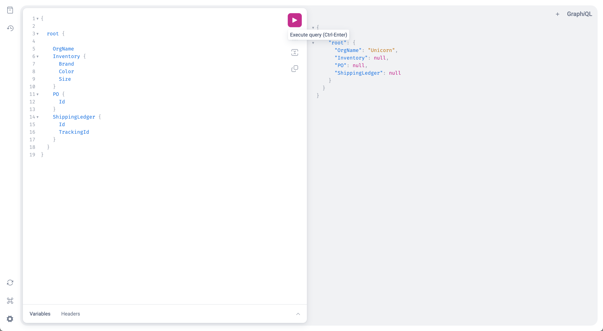

# Access SockShop data model through API


[[Prev]](Playground-SockShop-Install-Datamodel.md) [[Exit]](../../README.md) [[Next]](Playground-SockShop-App-Access.md)

## Port forward to the Nexus Runtime API server

***Hmm...why is this needed?***

Well, by default, Nexus Runtime does not expose a public endpoint.
So we expose Nexus API GW on the localhost through kubectl port forward.

```
kubectl port-forward svc/nexus-api-gw 8080:80 &
kubectl port-forward svc/nexus-apiserver 8081:8080 &
```


## Kubectl API Access

Lets instantiate sock shop by creating the SockShop node, via kubectl.

```
kubectl -s localhost:8080 apply -f - <<EOF
apiVersion: root.sockshop.com/v1
kind: SockShop
metadata:
  name: default
spec:
  orgName: Unicorn
  location: Seattle
  website: Unicorn.inc
EOF
```

## REST API is available [here](http://localhost:8080/sockshop.com/docs#/)



## GraphQL is available [here](http://localhost:8080/apis/graphql/v1)



[[Prev]](Playground-SockShop-Install-Datamodel.md) [[Exit]](../../README.md) [[Next]](Playground-SockShop-App-Access.md)