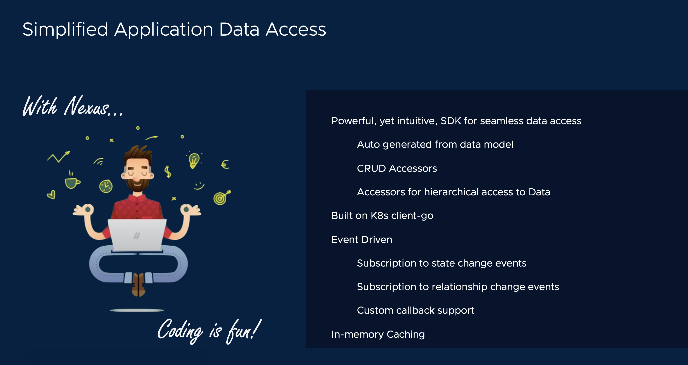

# Application Workflow



[[Prev]](Playground-SockShop-Access-Datamodel-API.md) [[Exit]](../../README.md) [[Next]](Playground-SockShop-App-Test.md)

Now, to demonstrate, how easy it is to write a fully functional, architecturally sound SaaS application that is production ready, let us write an application that will register to be notified on new orders. On receiving an order, the application will then initiate a shipment for the order.

## Import and initialize Nexus SDK from the build directory

```
import nexus_client "sockshop/build/nexus-client"
```

```
nexusClient, _ = nexus_client.NewForConfig(&rest.Config{Host: "localhost:8081",})
```

## Define your business logic to be run on Order creation event

The business problem this application solves is to watch for Orders.

If an Order is created, but it has not been shipped yet, the application will initiate Shipping.

If an Order is found and its already shipped, then the application will print the Tracking info.

```
func ProcessOrder(order *nexus_client.RootOrders) {

	// Check if the Order has a Shipping object associated with it, already.
	shipping, err := order.GetShipping(context.TODO())

	if nexus_client.IsLinkNotFound(err) {

		// No shipping object was found associated with this order.

		fmt.Printf("Hurray...Order %v received!\n", order.DisplayName())

		// Construct a Shipping object.
		shippingObj := &sockshopv1.Shipping{
			ObjectMeta: metav1.ObjectMeta{
				Name: order.DisplayName(),
			},
			Spec: sockshopv1.ShippingSpec{
				TrackingId: generateTrackingId(),
			},
		}

		// Create a shipping object.
		shippingInfo, _ := nexusClient.RootSockShop().AddShippingLedger(context.TODO(), shippingObj)

		// Associate the shipping object to the Order.
		order.LinkShipping(context.TODO(), shippingInfo)

		fmt.Printf("Order %v shipped to %v! Tracking Id: %v\n", order.DisplayName(), order.Spec.Address, shippingInfo.Spec.TrackingId)
	} else {

		// A shipping object was found associated with this order, already. Nothing to be done.

		fmt.Printf("Order %v has been shipped. Tracking Id: %v\n", order.DisplayName(), shipping.Spec.TrackingId)
	}
}

```
## Register the business logic as a callback on Order creation

```
	nexusClient.RootSockShop().PO("*").RegisterAddCallback(ProcessOrder)
```

That is it !!!

We just wrote a fully functional, architecturally sound SaaS application that is ready for SaaS and production.

## Complete application code workflow:

### Step 1: Go to top workdir
```
cd ..
```

### Step 2: Copy paste this code to file: main.go

```
package main

import (
	"context"
	"fmt"
	"math/rand"
	"os"
	"os/signal"
	sockshopv1 "sockshop/build/apis/root.sockshop.com/v1"
	nexus_client "sockshop/build/nexus-client"
	"syscall"
	"time"

	metav1 "k8s.io/apimachinery/pkg/apis/meta/v1"
	"k8s.io/client-go/rest"
)

func generateTrackingId() int {
	return rand.Intn(10000-1) + 1
}

func ProcessOrder(order *nexus_client.RootOrders) {

	// Check if the Order has a Shipping object associated with it, already.
	shipping, err := order.GetShipping(context.TODO())

	if nexus_client.IsLinkNotFound(err) {

		// No shipping object was found associated with this order.

		fmt.Printf("Hurray...Order %v received!\n", order.DisplayName())

		// Construct a Shipping object.
		shippingObj := &sockshopv1.Shipping{
			ObjectMeta: metav1.ObjectMeta{
				Name: order.DisplayName(),
			},
			Spec: sockshopv1.ShippingSpec{
				TrackingId: generateTrackingId(),
			},
		}

		// Create a shipping object.
		shippingInfo, _ := nexusClient.RootSockShop().AddShippingLedger(context.TODO(), shippingObj)

		// Associate the shipping object to the Order.
		order.LinkShipping(context.TODO(), shippingInfo)

		fmt.Printf("Order %v shipped to %v! Tracking Id: %v\n", order.DisplayName(), order.Spec.Address, shippingInfo.Spec.TrackingId)
	} else {

		// A shipping object was found associated with this order, already. Nothing to be done.

		fmt.Printf("Order %v has been shipped. Tracking Id: %v\n", order.DisplayName(), shipping.Spec.TrackingId)
	}
}

var nexusClient *nexus_client.Clientset

func main() {

	rand.Seed(time.Now().UnixNano())

	nexusClient, _ = nexus_client.NewForConfig(&rest.Config{Host: "localhost:8081"})

	nexusClient.RootSockShop().PO("*").RegisterAddCallback(ProcessOrder)

	sigs := make(chan os.Signal, 1)
	signal.Notify(sigs, syscall.SIGINT, syscall.SIGTERM)
	done := make(chan bool, 1)

	go func() {
		<-sigs
		done <- true
	}()
	<-done
	fmt.Println("exiting")
}

```
### Step 3: Let's run the Application

```
go mod tidy; go run main.go
```


[[Prev]](Playground-SockShop-Access-Datamodel-API.md) [[Exit]](../../README.md) [[Next]](Playground-SockShop-App-Test.md)