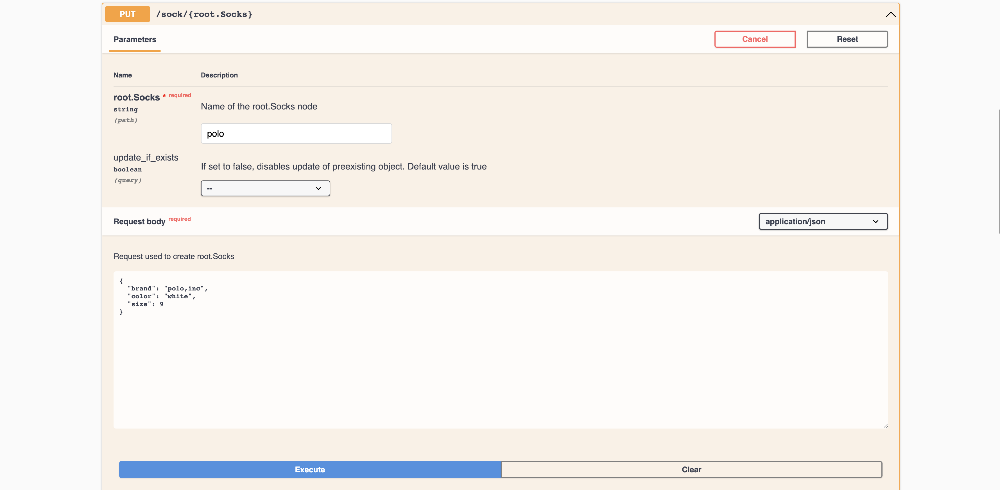
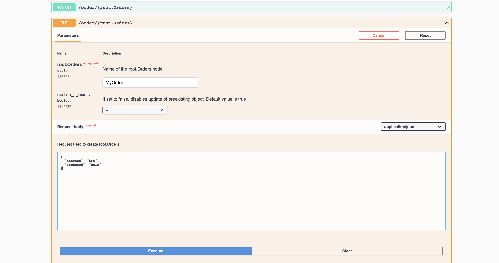
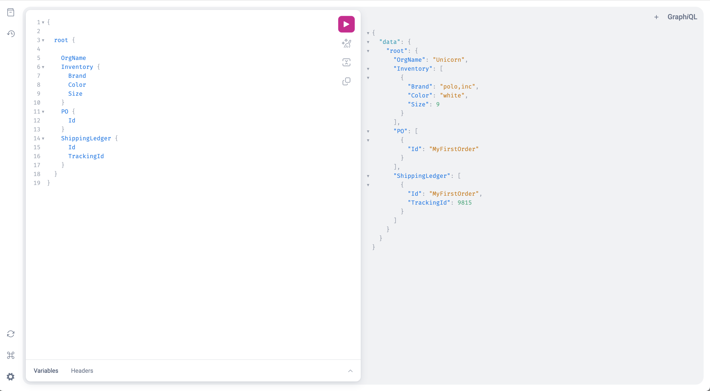

# Lets test our super duper Application

Let's take our SaaS Application for a spin.

[[Prev]](Playground-SockShop-App-Access.md) [[Exit]](../../README.md) [[Next]](Playground-SockShop-Wrap.md)

## Create a new inventory to our Socks through REST API

***Swagger UI is available [here](http://localhost:8080/sockshop.com/docs#/)***

Add a new Socks brand to our inventory.

```
HTTP Method: PUT

URI: /sock/{root.Socks}

Name of the root.Socks node: Polo

Spec:
{
  "brand": "polo,inc",
  "color": "white",
  "size": 9
}
```


## Let's place an Order for a Socks through REST API

***Swagger UI is available [here](http://localhost:8080/sockshop.com/docs#/)***

Place an Order.

```
HTTP Method: PUT

URI: /order/{root.Orders}

Name of the root.Orders node: MyFirstOrder

Spec:

{
  "address": "SFO",
  "sockName": "polo"
}
```


## Application will be notified of new order and will create a shipping request.

Through the Swagger page, add a new Socks brand to our inventory.

```
➜ go run main.go
RootOrders -->  RegisterAddCallback!
[RootOrders] ---NEW-INFORMER---->

Hurray...Order MyFirstOrder received!
Order MyFirstOrder shipped to SFO! Tracking Id: 9815
```

## Let's run some GraphQL query verify our data model

***GraphQL is available [here](http://localhost:8080/apis/graphql/v1)***

The below GraphQL query should fetch the order and shipping created in the data model.

```
{
  root {
    OrgName
    Inventory {
      Brand
      Color
      Size
    }
    PO {
      Id
    }
    ShippingLedger {
      Id
      TrackingId
    }
	}
}
```


[[Prev]](Playground-SockShop-App-Access.md) [[Exit]](../../README.md) [[Next]](Playground-SockShop-Wrap.md)