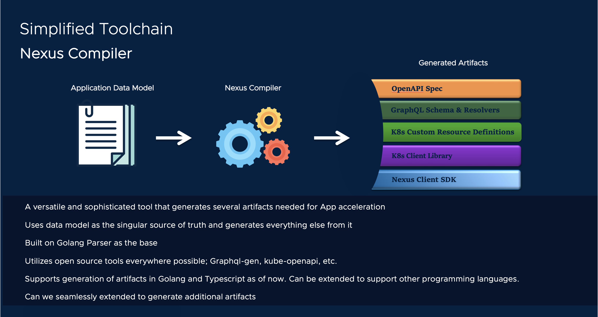

# Compile the data model



[[Prev]](Playground-SockShop-Complete-Datamodel.md) [[Exit]](../../README.md) [[Next]](Playground-SockShop-Install-Datamodel.md)


Let's build our data model and generate all the artifacts needed for the runtime.

## Compile data model

Nexus compiler can be invoked to build the datamodel with the following command:

```
nexus datamodel build --debug
```

This will generate all the artifacts needed at install and runtime.

The generated artifacts are available in the $PWD/build directory.

[[Prev]](Playground-SockShop-Complete-Datamodel.md) [[Exit]](../../README.md) [[Next]](Playground-SockShop-Install-Datamodel.md)