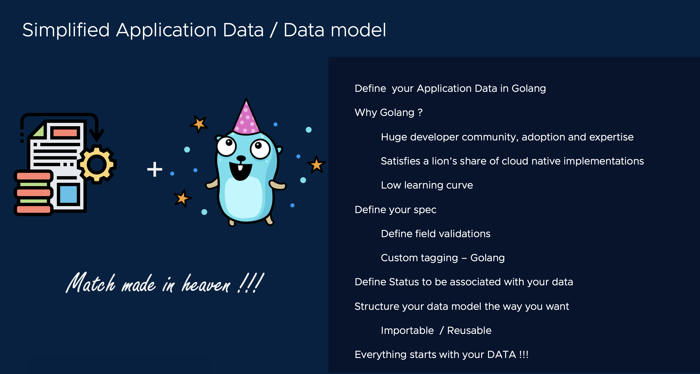

# Data model for Sock Shop
[[Prev]](Playground-SockShop-Lite.md) [[Exit]](../../README.md)   [[Next]](Playground-SockShop-Relationships-Lite.md)



Off the bat, we know that we need a data model to define our inventory and a runtime to store and manage it.

We start by defining a data model. If it sounds scary, Don't worry!. Let's start by initializing it's tool chain.

## Initialize data model

So we want to call our data model, sockshop.

```
# NOTE: NEXUS_REPO_DIR is the local directory where Nexus repo is clone to.
nexus datamodel init --name sockshop --group sockshop.com --local-dir $NEXUS_REPO_DIR
```

With the above init, the entire enchilada needed to define a fully functional data model is now ready.

We will now walkthrough writing datamodel spec one step at a time.

***If you prefer, skip to the completed datamodel spec for Sock Shop [here](Playground-SockShop-Complete-Datamodel-Lite.md)***

## Define a model to represent SockShop

Let's start writing out our data model spec, by editing the file: ***root.go***

```
type SockShop struct {
	nexus.SingletonNode

	OrgName  string
	Location string
	Website  string

}
```

## Define Inventory

This SockShop has an inventory of Socks. Each sock has its own attribute, like it's branding, color, sizing, etc.

```
type Socks struct {
	nexus.Node

	Brand string
	Color string
	Size  int
}
```

## Define Order model

We need a way to represent orders in the data model, that specifies which socks you are trying to buy and how to ship it. 

After all, we got to sell something :)

```
type Orders struct {
	nexus.Node

	SockName string
	Address  string

}
```

## Define Shipping model

[[Prev]](Playground-SockShop-Lite.md) [[Exit]](../../README.md)   [[Next]](Playground-SockShop-Relationships-Lite.md)

We also need a way to represent shipping info in our data model .

```
type Shipping struct {
	nexus.Node

	TrackingId int
}
```
[[Prev]](Playground-SockShop-Lite.md) [[Exit]](../../README.md)   [[Next]](Playground-SockShop-Relationships-Lite.md)
