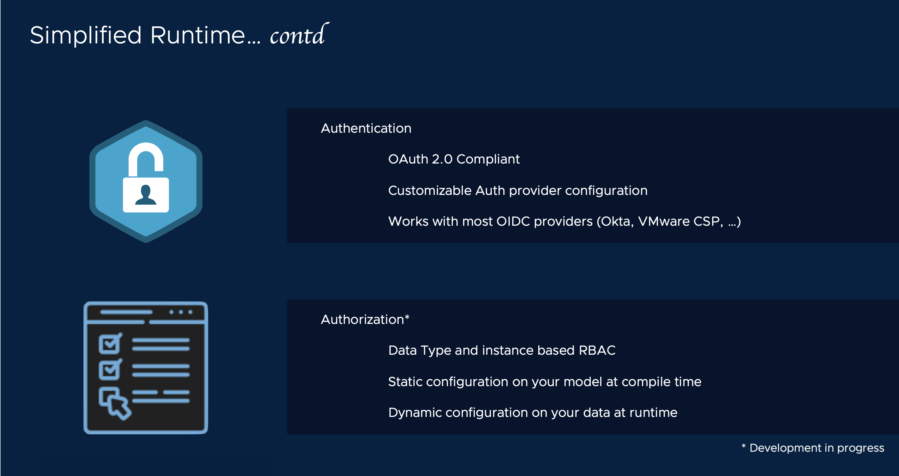

# Install Sock Shop data model on Nexus Runtime




[[Prev]](Playground-SockShop-Compile-Datamodel.md) [[Exit]](../../README.md) [[Next]](Playground-SockShop-Access-Datamodel-API.md)

Nexus data model is installed on a Nexus Runtime software stack.
## Install Nexus Runtime

**The following steps requires a running Kubernetes cluster >= version 1.19**

```
nexus runtime install --namespace default
```

## Install datamodel

<details><summary> NOTE: If your K8s cluster is running on Kind cluster, please expand</summary>

Load the data model image into your Kind sandbox.

```
kind load docker-image sockshop.com:latest --name <kind cluster name>
```
</details>

### Install data model
```
nexus datamodel install image sockshop.com:latest --namespace default
```

[[Prev]](Playground-SockShop-Compile-Datamodel.md) [[Exit]](../../README.md) [[Next]](Playground-SockShop-Access-Datamodel-API.md)