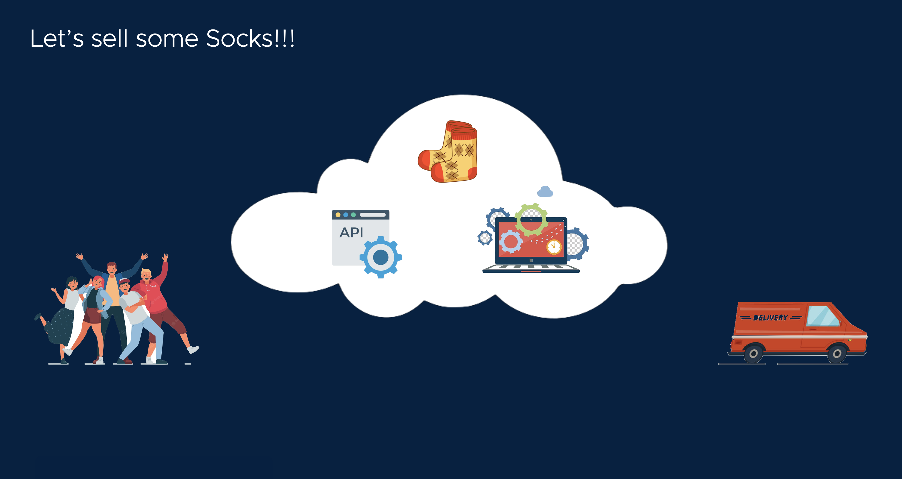

# Let's build our playground application: Sock Shop
[[Prev]](Playground-InstallRuntime-Lite.md) [[Exit]](../../README.md)  [[Next]](Playground-SockShop-Datamodel-Lite.md)



Imagine this scenario.

One fine morning, over the first cup of coffee, we have this brilliant idea of setting up a Sock shop. By the time we are finished with our coffee it is clear to us that SaaS is the way to go.

This playground will demonstrate how Nexus can make that desire, a reality, by the time we are done with our breakfast, so to speak.

## Setup Workspace
```
mkdir sock-shop-saas-app;cd sock-shop-saas-app;
go mod init demo;
go mod tidy;
go mod edit -replace sockshop=./datamodel;
mkdir datamodel; cd datamodel
```

[[Prev]](Playground-InstallRuntime-Lite.md) [[Exit]](../../README.md)  [[Next]](Playground-SockShop-Datamodel-Lite.md)