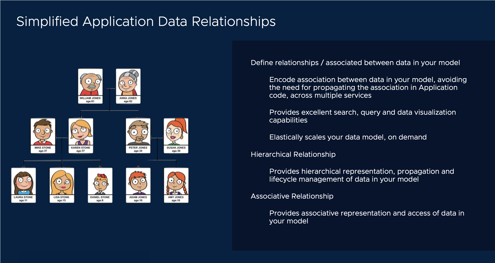
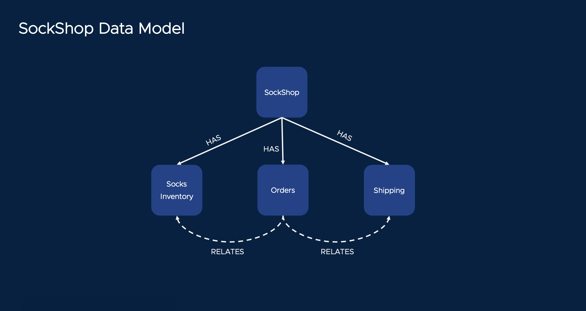

# Structure relationships between the types in your model

[[Prev]](Playground-SockShop-Datamodel-Lite.md) [[Exit]](../../README.md) [[Next]](Playground-SockShop-API-Lite.md)



Lets specify relationship between the different node types in the model.

We are trying to achieve the following hierarchical view



Lets annotate our desired hierarchy in the data model spec.
## Relationships on SockShop Type

```
type SockShop struct {
	nexus.SingletonNode

	OrgName  string
	Location string
	Website  string

	Inventory      Socks    `nexus:"children"`
	PO             Orders   `nexus:"children"`
	ShippingLedger Shipping `nexus:"children"`
}
```

## Relationships on Order Type

```
type Orders struct {
	nexus.Node

	SockName string
	Address  string

	Cart     Socks    `nexus:"link"`
	Shipping Shipping `nexus:"link"`
}
```

[[Prev]](Playground-SockShop-Datamodel-Lite.md) [[Exit]](../../README.md) [[Next]](Playground-SockShop-API-Lite.md)
