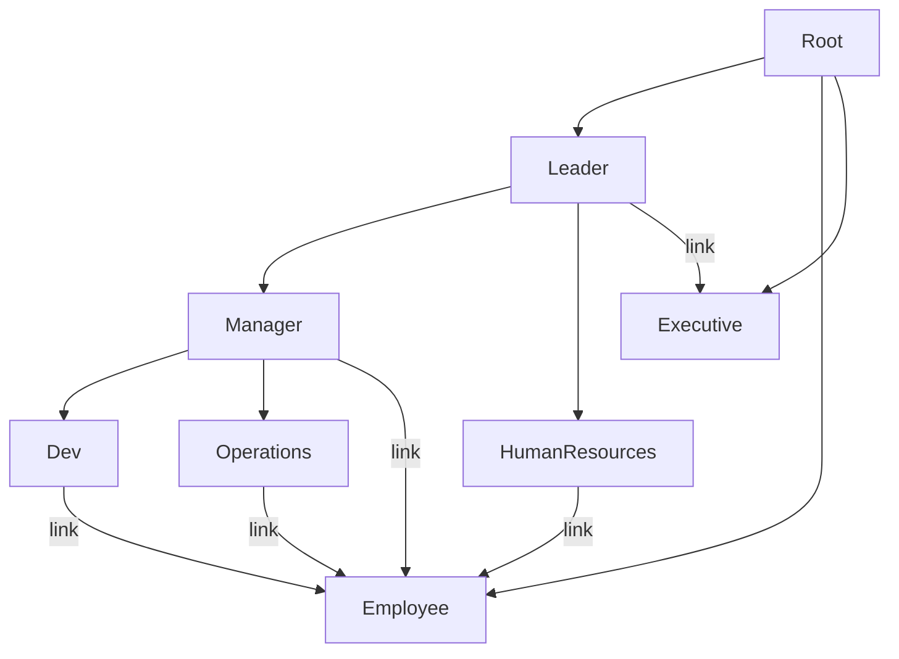

# Nexus Scaling

This document captures the details about nexus scaletests and the max resource utilization and turn-around time in the event of any particualr service failures.

## Testcase1

### Org Chart Datamodel


Scale database to have 100K objects

100 Managers (parent)

1000 Ops (children)
```

### Resource Configuration Per Service

| Service | CPU | Memory | Replicas | Resource Usage at peak |
|---------|-----|--------|----------|------------------------|
|Nexus API Gateway|490m|512Mi  |1| |
|Nexus Kube API Server|480m|No Limit|1||
|Nexus Kube Ctrl Mgr|490m|512Mi|1| |
|Nexus ETCD|480m|No Limit|1|
|Nexus GraphQL|490m|2Gi|1| |
|Nexus Validation|490m|480Mi|1|
|Nexus Controller|480m|480Mi|1|

### Key Stats With 100K objects in the system

1. GraphQL responds within ~ 8 seconds to query 100K objects
2. On GraphQL Server restart, it takes ~ 4 Minutes to respond first successful query  
